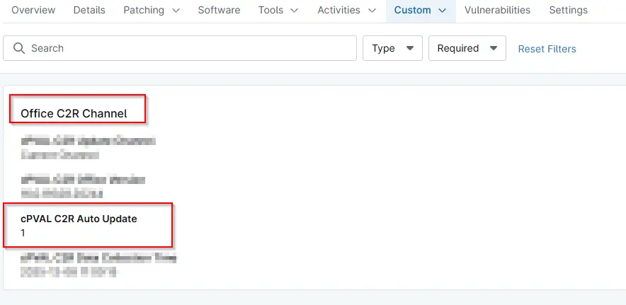

## Summary
Indicates if the C2R Office Auto Update is enabled on the machine, as gathered by the Microsoft 365 - Click-to-Run - Get Details Script.

## Details

| Label | Field Name | Definition Scope | Type | Required | Default Value | Technician Permission | Automation Permission | API Permission | Description | Tool Tip | Footer Text |  Custom Field Tab Name |
| ----- | ----- | ----- | ----- | ----- | ----- | ----- | ----- | ----- | ----- | ----- | ----- | ----- | 
| cPVAL C2R Auto Update | cpvalC2rAutoUpdate | Device | Text | False | | Read Only | Read/Write | Read/Write | Indicates if the C2R Office Auto Update is enabled on the machine, as gathered by the Microsoft 365 - Click-to-Run - Get Details Script. | Indicates if the C2R Office Auto Update is enabled on the machine | Indicates if the C2R Office Auto Update is enabled on the machine, as gathered by the Microsoft 365 - Click-to-Run - Get Details Script. | Office C2R Details |

## Dependencies
- [Solution - Microsoft 365 - Click-to-Run - Get Details](/docs/f493756c-e4e0-4aba-af87-9aef14f389aa) 

## Custom Field Creation

[Custom Field Configuration](https://github.com/ProVal-Tech/ninjarmm/blob/main/custom-fields/cpval-c2r-auto-update.toml)

## Sample Screenshot

