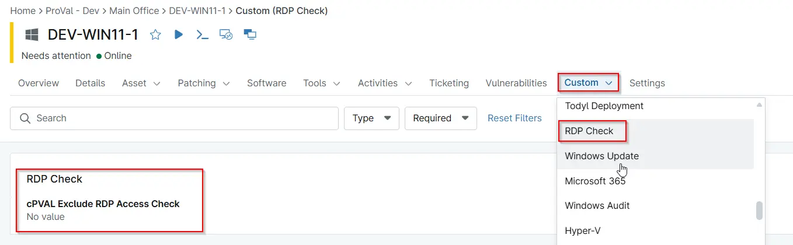

## Summary

This custom field is used to display the current status of Remote Desktop Protocol (RDP) access on the device.

## Details

| Label | Field Name | Definition Scope | Type | Required | Default Value | Technician Permission | Automation Permission | API Permission | Description | Tool Tip | Footer Text |  Custom Field Tab Name |
| ----- | ---- | ---------------- | ---- | -------- | ------------- | --------------------- | --------------------- | -------------- | ----------- | -------- | ----------- | ----------- |
| cPVAL Check RDP Access Status | cpvalCheckRdpAccessStatus | `Device`, `Location`, `Organization` | Text | false | -- |  Editable | `Read/Write` | `Read/Write` | This custom field is used to display the current status of Remote Desktop Protocol (RDP) access on the device. | Displays whether RDP access is enabled or disabled on the device. | Used by the RDP Access Check solution to track the current RDP access status. | RDP Check |

## Dependencies

- [Automation - RDP Access Check](/docs/4d9087cb-0cf3-4ade-863f-3a14c9b73d5e)
- [Solution - RDP Access Check](/docs/98bae338-07b5-482a-81e1-1b19582122c8) 
- [Compound Conditions - RDP Access Check - servers](/docs/36261bfe-2318-45de-bc24-ffd62a2422a4)
- [Compound Conditions - RDP Access Check - Workstations](/docs/f7b08fe4-9eb4-4716-a9ea-84bedfa2f838)

## Custom Field Creation

- [Custom Field Configuration](https://github.com/ProVal-Tech/ninjarmm/blob/main/custom-fields/rdp-access-check-servers.toml)

## Sample Screenshot

## Changelog

### 2026-07-20

- Initial version of the document
