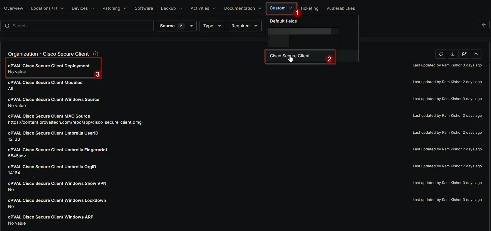

## Summary

Use this field to specify which operating system should receive Cisco Secure Client automatically. If you select “Disable,” the deployment will not occur for this configuration level.

## Details

| Label | Field Name | Definition Scope | Type | Required | Default Value | Options | Technician Permission | Automation Permission | API Permission | Description | Tool Tip | Footer Text |  Custom Field Tab Name |
| ----- | ---- | ---------------- | ---- | -------- | ------------- | ------------- | --------------------- | --------------------- | -------------- | ----------- | -------- | ----------- | ----------- |
| cPVAL Cisco Secure Client Deployment | cpvalCiscoSecureClientDeployment | `Organization`, `Location`, `Device` | Drop-down | False | | <ul><li>Disable</li><li>All</li><li>Windows Workstations</li><li>Windows Server</li><li>Macintosh</li><li>Windows</li><li>Windows Workstations and Macintosh</li></ul> | Editable | Read_Write | Read_Write | Use this field to specify which operating system should receive Cisco Secure Client automatically. If you select “Disable,” the deployment will not occur for this configuration level. | Select the operating system for Cisco Secure Client auto deployment. Choose “Disable” to exclude deployment at this level. | Tip: Selecting “Disable” overrides auto deployment for the chosen level. Ensure other levels are configured as needed. | Cisco Secure Client |

## Dependencies

- [Solution: Cisco Secure Client](/docs/b6926fc9-732f-4a5e-a42d-eae36c61c033)

## Custom Field Creation

[Custom Field Configuration](https://github.com/ProVal-Tech/ninjarmm/blob/main/custom-fields/cpval-cisco-secure-client-deployment.toml)

## Sample Screenshot

