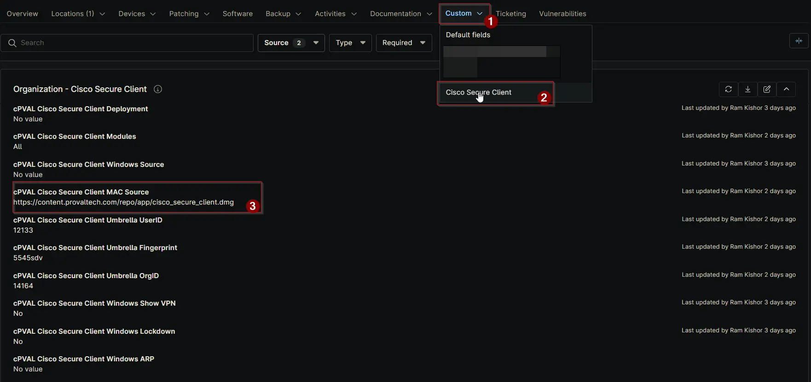

## Summary

Provide the download URL or local path for the .dmg file used to install Cisco Secure Client modules.

## Details

| Label | Field Name | Definition Scope | Type | Required | Default Value | Options | Technician Permission | Automation Permission | API Permission | Description | Tool Tip | Footer Text |  Custom Field Tab Name |
| ----- | ---- | ---------------- | ---- | -------- | ------------- | ------------- | --------------------- | --------------------- | -------------- | ----------- | -------- | ----------- | ----------- |
| cPVAL Cisco Secure Client MAC Source | cpvalCiscoSecureClientMacSource | `Organization`, `Location`, `Device` | Text | False | | | Editable | Read_Write | Read_Write | Provide the download URL or local path for the .dmg file used to install Cisco Secure Client modules. | Enter the full URL or local file path pointing to the .dmg installer for Cisco Secure Client modules. This file will be used during the installation process. | Tip: Ensure the path or URL is accessible from the target system to avoid installation failures. | Cisco Secure Client |

## Dependencies

- [Solution: Cisco Secure Client](/docs/b6926fc9-732f-4a5e-a42d-eae36c61c033)

## Custom Field Creation

[Custom Field Configuration](https://github.com/ProVal-Tech/ninjarmm/blob/main/custom-fields/cpval-cisco-secure-client-mac-source.toml)

## Sample Screenshot

