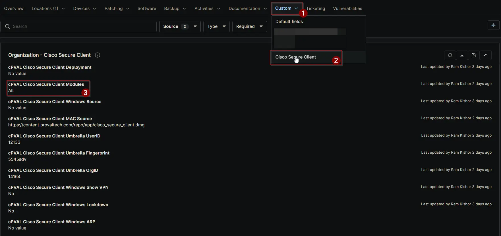

## Summary

Use this field to specify which modules should be installed. If you select “All,” all available modules will be installed regardless of other selections.
Note: If the Umbrella module is selected, you must configure UserID, Fingerprint, and OrgID.

## Details

| Label | Field Name | Definition Scope | Type | Required | Default Value | Options | Technician Permission | Automation Permission | API Permission | Description | Tool Tip | Footer Text |  Custom Field Tab Name |
| ----- | ---- | ---------------- | ---- | -------- | ------------- | ------------- | --------------------- | --------------------- | -------------- | ----------- | -------- | ----------- | ----------- |
| cPVAL Cisco Secure Client Modules | cpvalCiscoSecureClientModules | `Organization`, `Location`, `Device` | Multi-select | False | | <ul><li>All</li><li>Core-VPN</li><li>Umbrella</li><li>Diagnostic And Reporting Tool</li><li>Network Visibility Module</li><li>ISE Posture</li><li>ThousandEyes Endpoint</li><li>Zero Trust Access</li><li>Start Before Login (Windows Only)</li><li>Network Access Manager (Windows Only)</li><li>VPN Posture (Windows Only)</li><li>Duo (Mac Only)</li><li>Fireamp (Mac Only)</li><li>Secure Firewall Posture (Mac Only)</li></ul> | Editable | Read_Write | Read_Write | Use this field to specify which modules should be installed. If you select “All,” all available modules will be installed regardless of other selections. Note: If the Umbrella module is selected, you must configure UserID, Fingerprint, and OrgID. | Select the modules to install on the computer. Choosing “All” will override individual selections and install every module. | Tip: Selecting “All” installs every module. For Umbrella, ensure required identifiers (userid, fingerprint, OrgID) are set. | Cisco Secure Client |

## Dependencies

- [Solution: Cisco Secure Client](/docs/b6926fc9-732f-4a5e-a42d-eae36c61c033)

## Custom Field Creation

[Custom Field Configuration](https://github.com/ProVal-Tech/ninjarmm/blob/main/custom-fields/cpval-cisco-secure-client-modules.toml)

## Sample Screenshot

