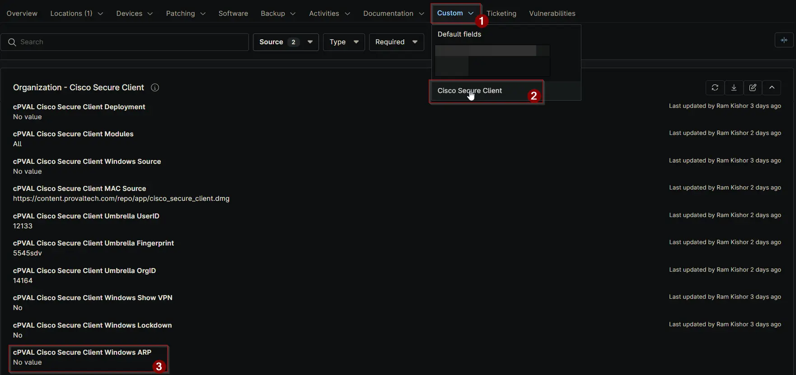

## Summary

Check this box if you want Cisco Secure Client modules to be hidden from the Add/Remove Programs section in Windows. This setting applies only to Windows systems.

## Details

| Label | Field Name | Definition Scope | Type | Required | Default Value | Options | Technician Permission | Automation Permission | API Permission | Description | Tool Tip | Footer Text |  Custom Field Tab Name |
| ----- | ---- | ---------------- | ---- | -------- | ------------- | ------------- | --------------------- | --------------------- | -------------- | ----------- | -------- | ----------- | ----------- |
| cPVAL Cisco Secure Client Windows ARP | cpvalCiscoSecureClientWindowsArp | `Organization`, `Location`, `Device` | Checkbox | False | | | Editable | Read_Write | Read_Write | Check this box if you want Cisco Secure Client modules to be hidden from the Add/Remove Programs section in Windows. This setting applies only to Windows systems. | Enable this option to hide installed modules from the Add/Remove Programs list. | Tip: Leave unchecked to keep modules visible in Add/Remove Programs. This option is supported only on Windows machines.| Cisco Secure Client |

## Dependencies

- [Solution: Cisco Secure Client](/docs/b6926fc9-732f-4a5e-a42d-eae36c61c033)

## Custom Field Creation

[Custom Field Configuration](https://github.com/ProVal-Tech/ninjarmm/blob/main/custom-fields/cpval-cisco-secure-client-windows-arp.toml)

## Sample Screenshot

