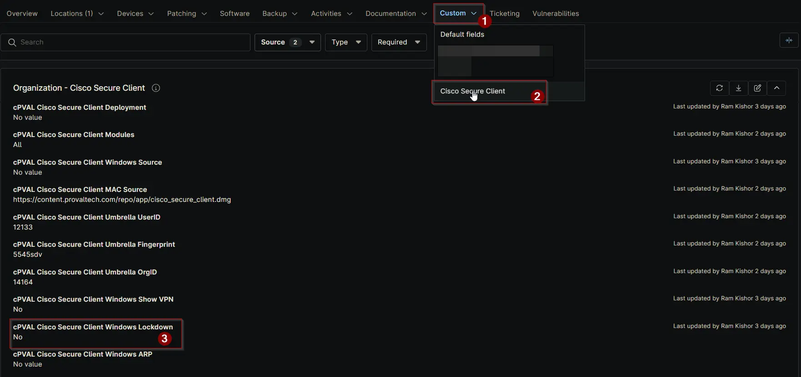

## Summary

Check this box to lock Cisco Secure Client services and prevent any modifications. This lockdown applies to all users, including administrators. This setting is supported only on Windows systems.

## Details

| Label | Field Name | Definition Scope | Type | Required | Default Value | Options | Technician Permission | Automation Permission | API Permission | Description | Tool Tip | Footer Text |  Custom Field Tab Name |
| ----- | ---- | ---------------- | ---- | -------- | ------------- | ------------- | --------------------- | --------------------- | -------------- | ----------- | -------- | ----------- | ----------- |
| cPVAL Cisco Secure Client Windows Lockdown | cpvalCiscoSecureClientWindowsLockdown | `Organization`, `Location`, `Device` | Checkbox | False | | | Editable | Read_Write | Read_Write | Check this box to lock Cisco Secure Client services and prevent any modifications. This lockdown applies to all users, including administrators. This setting is supported only on Windows systems. | Enable this option to prevent Cisco Secure Client services from being modified. Administrators are not exempt from this restriction. Applicable for Windows only. | Tip: Leave unchecked to allow service modifications. When enabled, even administrators cannot change Cisco Secure Client services. Windows only. | Cisco Secure Client |

## Dependencies

- [Solution: Cisco Secure Client](/docs/b6926fc9-732f-4a5e-a42d-eae36c61c033)

## Custom Field Creation

[Custom Field Configuration](https://github.com/ProVal-Tech/ninjarmm/blob/main/custom-fields/cpval-cisco-secure-client-windows-lockdown.toml)

## Sample Screenshot

