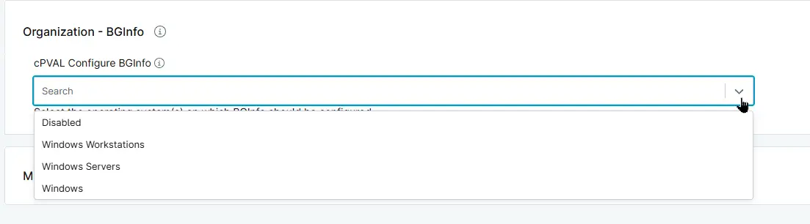

## Summary
Custom Field to select the operating system(s) on which BGInfo should be configured.

## Details

| Label | Field Name | Definition Scope | Type | Option Value | Default Value | Required  | Technician Permission | Automation Permission | API Permission | Description | Tool Tip | Footer Text | Custom Field Tab Name |
| ----- | ---------- | ---------------- | ---- | ------------ | ------------- | --------- | --------------------- | --------------------- | -------------- | ----------- | -------- | ----------- | ----------- |
| cPVAL Configure BGInfo | cpvalConfigureBginfo | `Organization`, `Location`, `Device` | drop-down | `Windows`, `Windows Workstations`, `Windows Servers`, `Disabled` | `Disabled` | False | Editable | Read/Write | Read/Write | Select the operating system(s) on which BGInfo should be configured. | Select the operating system(s) on which BGInfo should be configured. | Select the operating system(s) on which BGInfo should be configured. | BGInfo | 

## Dependencies

- [Solution - Configure BgInfo](/docs/e6f8548f-1459-4f72-9d77-be33dc4d89a6)

## Custom Field Creation

- [Custom Field Configuration](https://github.com/ProVal-Tech/ninjarmm/blob/main/custom-fields/cpval-configure-bginfo.toml)

## Sample Screenshot

## Changelog

### 2026-09-22

- Initial version of the document
