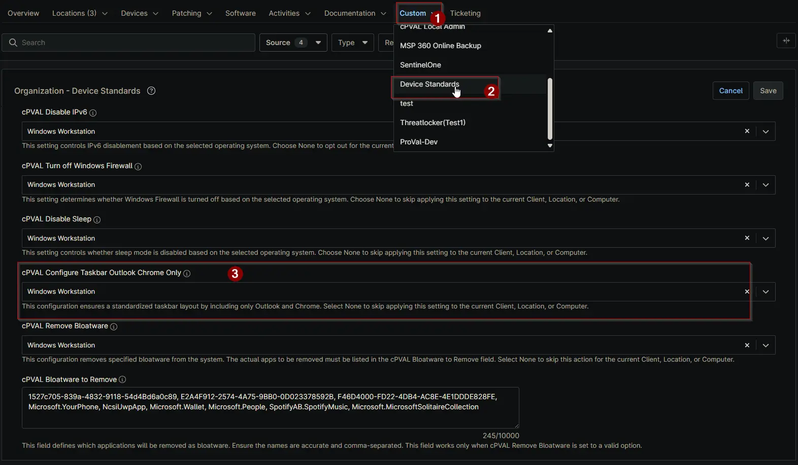

## Summary

This custom field ensures a standardized taskbar layout by including only Outlook and Chrome. Select `None` to skip applying this setting to the current Client, Location, or Computer.

## Details

| Label | Field Name | Definition Scope | Type | Required | Default Value | Available Options | Technician Permission | Automation Permission | API Permission | Description | Tool Tip | Footer Text | Custom Field Tab Name |
| ----- | ---- | ---------------- | ---- | -------- | ------------- | --------------------- | --------------------- | -------------- | ----------- | -------- | ----------- | ----------- | ----------- |
| cPVAL Configure Taskbar Outlook Chrome Only | cpvalConfigureTaskbarOutlookChromeOnly | `Organization`, `Location`, `Device` | Drop-down | False | | `None`, `Windows Workstation` | Editable | Read_Write | Read_Write | Configure the taskbar to show only Microsoft Outlook and Google Chrome. All other pinned applications will be removed.| Use this setting to pin only Outlook and Chrome to the taskbar. Existing pinned apps will be cleared. | This configuration ensures a standardized taskbar layout by including only Outlook and Chrome. Select None to skip applying this setting to the current Client, Location, or Computer. | Device Standards |

## Dependencies

- [Solution - Configure Taskbar Outlook Chrome Only](/docs/8efbc9f2-0812-40c2-8583-a563049c7762)
- [Solution - Device Standards](/docs/a0c383d4-699a-4bb8-af7f-c2a007747182)

## Custom Field Creation

[Custom Field Configuration](https://github.com/ProVal-Tech/ninjarmm/blob/main/custom-fields/cpval-configure-taskbar-outlook-chrome-only.toml)

## Sample Screenshot

