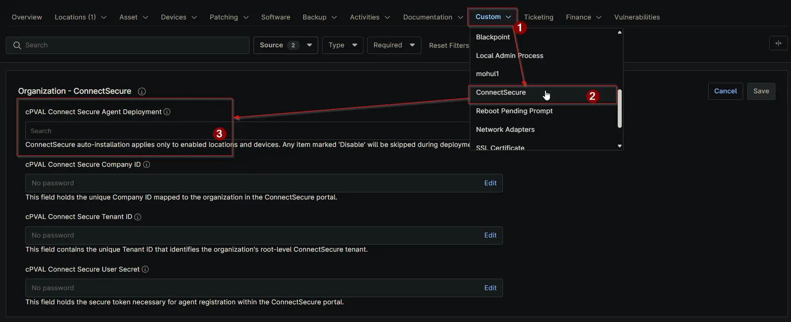
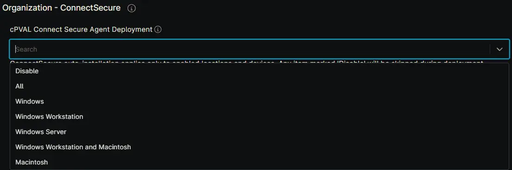

## Summary

Select the operating system to enable automatic ConnectSecure installation. Choosing 'Disable' at the location or device level will prevent that location or device from being included in the automated installation process.

## Details

| Label | Field Name | Definition Scope | Type | Required | Default Value | Technician Permission | Automation Permission | API Permission | Description | Tool Tip | Footer Text |  Custom Field Tab Name |
| ----- | ---- | ---------------- | ---- | -------- | ------------- | --------------------- | --------------------- | -------------- | ----------- | -------- | ----------- | ----------- |
| cPVAL Connect Secure Agent Deployment | cpvalConnectSecureAgentDeployment | `Organization`, `Location`, `Device` | Drop-Down | True (for auto-deployment) | <ul><li>Disable</li><li>All</li><li>Windows</li><li>Windows Workstation</li><li>Windows Server</li><li>Windows Workstation and Macintosh</li><li>Macintosh</li></ul> | Editable | Read/Write | Read/Write | Select the operating system to enable automatic ConnectSecure installation. Choosing 'Disable' at the location or device level will prevent that location or device from being included in the automated installation process. | Choose the OS to activate ConnectSecure auto-installation. If set to 'Disable' for a location or device, it will be excluded from automated deployment. | ConnectSecure auto-installation applies only to enabled locations and devices. Any item marked 'Disable' will be skipped during deployment. | ConnectSecure |

## Dependencies

- [Solution - ConnectSecure Agent Deployment](/docs/0e33b1a2-5539-4451-b49d-2ba9b7f904dd)

## Custom Field Creation

[Custom Field Configuration](https://github.com/ProVal-Tech/ninjarmm/blob/main/custom-fields/cpval-connect-secure-agent-deployment.toml)

## Sample Screenshot

## Changelog

### 2026-03-16

- Renamed from `cPVAL ConnectSecure Deployment` to `cPVAL Connect Secure Agent Deployment`.
- Changed drop-down options.

### 2025-12-10

- Initial version of the document
