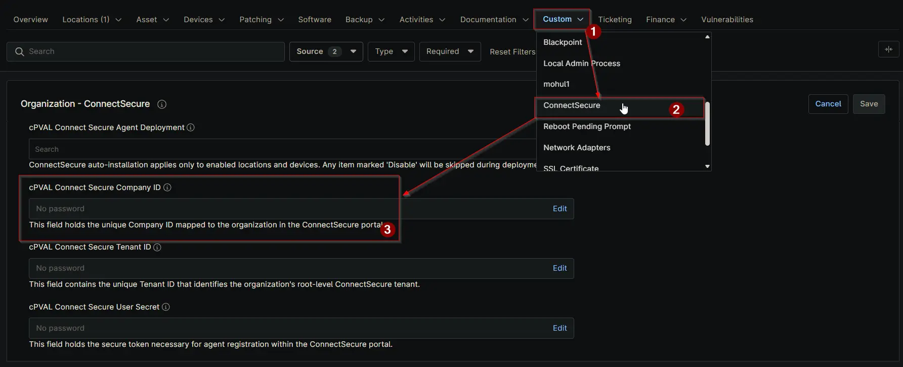

## Summary

Stores the ConnectSecure Company ID associated with this organization. This value uniquely identifies the company within the ConnectSecure portal.

## Details

| Label | Field Name | Definition Scope | Type | Required | Default Value | Technician Permission | Automation Permission | API Permission | Description | Tool Tip | Footer Text |  Custom Field Tab Name |
| ----- | ---- | ---------------- | ---- | -------- | ------------- | --------------------- | --------------------- | -------------- | ----------- | -------- | ----------- | ----------- |
| cPVAL Connect Secure Company ID | cpvalConnectSecureCompanyId | `Organization`, `Location`, `Device` | Secure | True | | Editable | Read/Write | Read/Write | Stores the ConnectSecure Company ID associated with this organization. This value uniquely identifies the company within the ConnectSecure portal. | Enter the ConnectSecure Company ID assigned to this organization. | This field holds the unique Company ID mapped to the organization in the ConnectSecure portal. | ConnectSecure |

## Dependencies

- [Solution - ConnectSecure Agent Deployment](/docs/0e33b1a2-5539-4451-b49d-2ba9b7f904dd)

## Custom Field Creation

[Custom Field Configuration](https://github.com/ProVal-Tech/ninjarmm/blob/main/custom-fields/cpval-connect-secure-company-id.toml)

## Sample Screenshot

## Changelog

### 2026-03-16

- Change the field type to `Secure` from `Text`.

### 2025-12-10

- Initial version of the document
