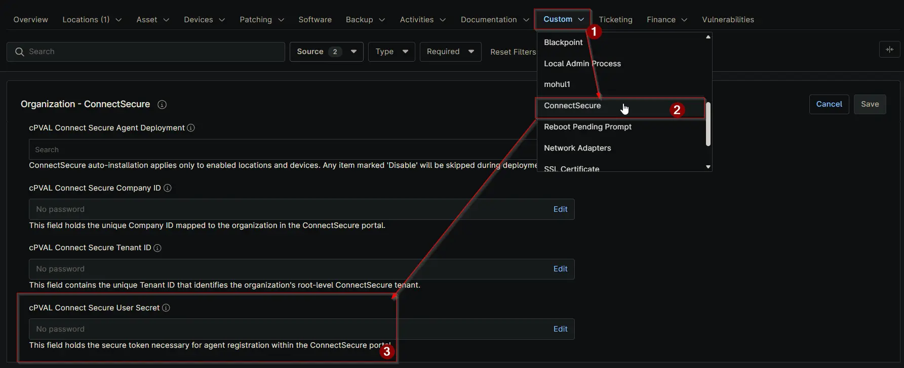

## Summary

Stores the authentication secret/token required for registering the agent with the ConnectSecure portal.

## Details

| Label | Field Name | Definition Scope | Type | Required | Default Value | Technician Permission | Automation Permission | API Permission | Description | Tool Tip | Footer Text |  Custom Field Tab Name |
| ----- | ---- | ---------------- | ---- | -------- | ------------- | --------------------- | --------------------- | -------------- | ----------- | -------- | ----------- | ----------- |
| cPVAL Connect Secure User Secret | cpvalConnectSecureUserSecret | `Organization`, `Location`, `Device` | Secure | True | | Editable | Read/Write | Read/Write | Stores the authentication secret/token required for registering the agent with the ConnectSecure portal. | Enter the authentication secret used to authorize and register the agent. | This field holds the secure token necessary for agent registration within the ConnectSecure portal. | ConnectSecure |

## Dependencies

- [Solution - ConnectSecure Agent Deployment](/docs/0e33b1a2-5539-4451-b49d-2ba9b7f904dd)

## Custom Field Creation

[Custom Field Configuration](https://github.com/ProVal-Tech/ninjarmm/blob/main/custom-fields/cpval-connect-secure-user-secret.toml)

## Sample Screenshot

## Changelog

### 2026-03-16

- Initial version of the document
