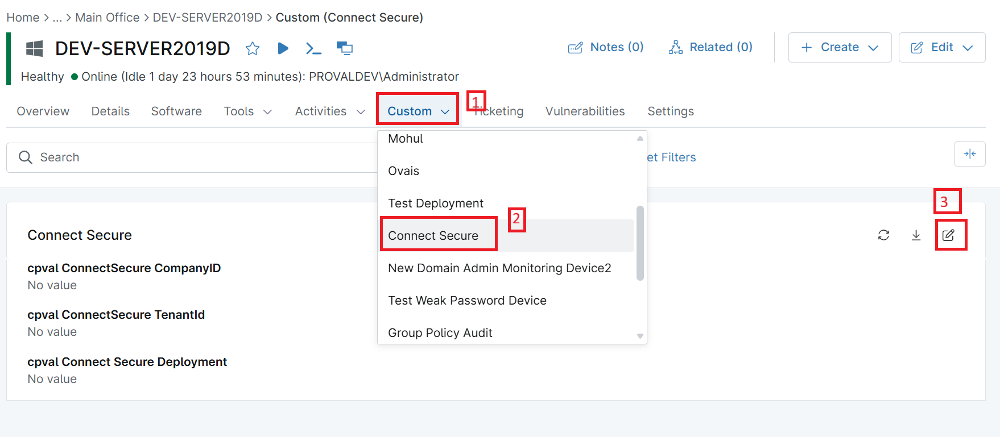
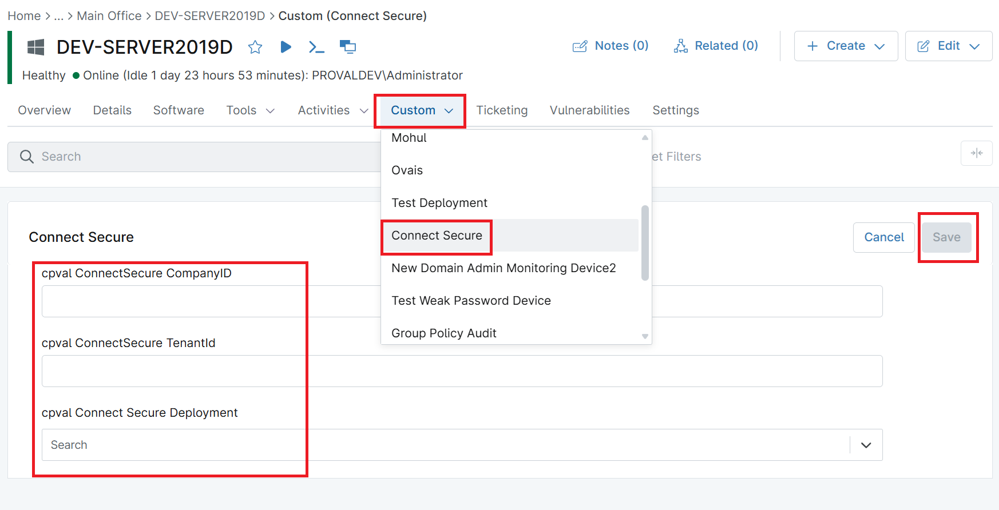

## Summary

This stores the ConnectSecure deployment company ID.

## Details

| Label | Field Name | Definition Scope | Type | Required | Default Value | Technician Permission | Automation Permission | API Permission | Description | Tool Tip | Footer Text |  Custom Field Tab Name |
| ----- | ---- | ---------------- | ---- | -------- | ------------- | --------------------- | --------------------- | -------------- | ----------- | -------- | ----------- | ----------- |
| cpval ConnectSecure CompanyID | cpvalConnectsecureCompanyid | `Organization`, `Location`, `Device` | Text | True | | Editable | Read/Write | Read/Write | This stores the ConnectSecure deployment company ID | | | Connect Secure |

## Dependencies

[Script - CyberCNSv4 ConnectSecurev4 Windows - Install/Update](/docs/d22e3b29-76a2-4385-a013-d592f6c5ae6d)

## Custom Field Creation

[Custom Field Configuration](https://github.com/ProVal-Tech/ninjarmm/blob/main/custom-fields/_template.toml)

## Sample Screenshot

