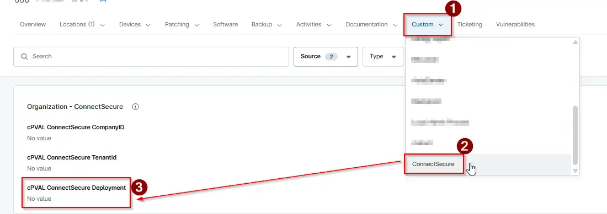
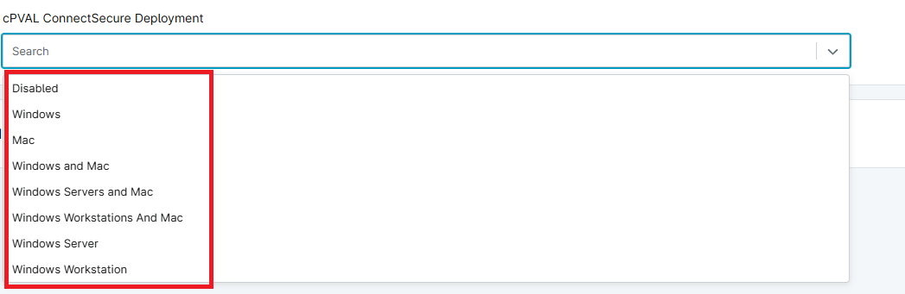

## Summary

Choose the operating system to activate the auto deployment of the `ConnectSecure Vulnerability Scan Agent`.

## Details

| Label | Field Name | Definition Scope | Type | Required | Default Value | Technician Permission | Automation Permission | API Permission | Description | Tool Tip | Footer Text |  Custom Field Tab Name |
| ----- | ---- | ---------------- | ---- | -------- | ------------- | --------------------- | --------------------- | -------------- | ----------- | -------- | ----------- | ----------- |
| cPVAL ConnectSecure Deployment | cpvalConnectsecuredeployment | `Organization`, `Location`, `Device` | Drop-Down | False | `Disabled`, `Windows`, `Windows Servers`, `Windows Workstations`, `Mac`, `Windows and Mac`, `Windows Workstations and Mac`, `Windows Servers and Mac` | Editable | Read/Write | Read/Write | Choose the operating system to activate the auto deployment of the `ConnectSecure Vulnerability Scan Agent`. | | | ConnectSecure |

## Dependencies

- [Script - CyberCNSv4 ConnectSecurev4 Windows - Install/Update](/docs/d22e3b29-76a2-4385-a013-d592f6c5ae6d)
- [Script - CyberCNS ConnectSecure Mac - Install/Update](/docs/19378af5-7ee0-43b4-8051-58b280467a6c)
- [Solution - Install ConnectSecure Windows/Mac](/docs/0e33b1a2-5539-4451-b49d-2ba9b7f904dd)

## Custom Field Creation

[Custom Field Configuration](https://github.com/ProVal-Tech/ninjarmm/blob/main/custom-fields/cpval-connectsecure-deployment.toml)

## Sample Screenshot

