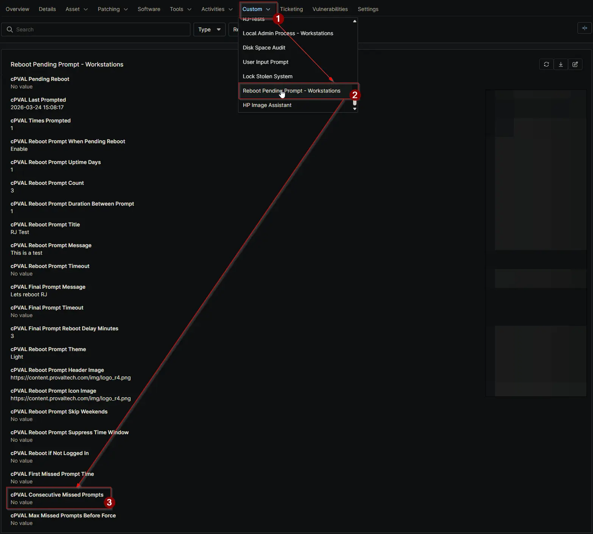

## Summary

Counts consecutive detection cycles where a prompt was missed due to a locked screen or no logged-in user.

## Details

| Label | Field Name | Definition Scope | Type | Required | Default Value | Technician Permission | Automation Permission | API Permission | Description | Tool Tip | Footer Text | Org Level Tab | Location Level Tab | Device Level Tab |
| ----- | ---- | ---------------- | -------- | ------------- | ---------------- | --------------------- | --------------------- | -------------- | ----------- | -------- | ----------- | ----------- | ----------- | ----------- |
| cPVAL Consecutive Missed Prompts | cpvalConsecutiveMissedPrompts | Device | Integer | False | | Editable | Read_Write | Read_Write | Counts consecutive detection cycles where a prompt was missed due to a locked screen or no logged-in user. | Increments when skipped. Weekends do NOT count if 'Skip Weekends' is enabled. Resets when unlocked. | Auto-managed. Resets to 0 on success or reboot. | Reboot Pending Prompt | Reboot Pending Prompt | Reboot Pending Prompt - Workstations |

## Dependencies

- [Solution: Reboot Pending Prompt](/docs/d7758fa4-9fcc-4259-a7a5-0ca65dda10eb)

## Custom Field Creation

- [Custom Field Configuration](https://github.com/ProVal-Tech/ninjarmm/blob/main/custom-fields/cpval-consecutive-missed-prompts.toml)

## Sample Screenshot

## Changelog

### 2026-06-03

- Initial version of the document
