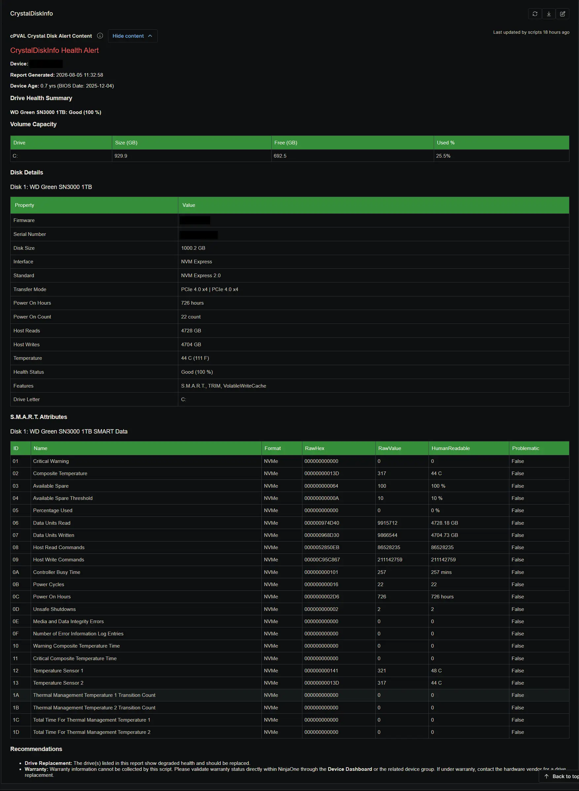

## Summary

The `cPVAL Crystal Disk Alert Content` custom field stores the pre-formatted HTML ticket payload when a drive health issue is detected. It includes device age, volume capacity, basic disk details, S.M.A.R.T. attributes, and replacement recommendations. It is populated and cleared automatically by the [Proactive Disk Health Monitor](/docs/acd55d90-1704-440c-a92e-795c230ecf9a) solution based on the state of the [cPVAL Crystal Disk Alert Required](/docs/1e6d84a9-b25c-4d7f-a3b6-7f4e92c8d5a1) checkbox.

## Details

| Label | Field Name | Example | Definition Scope | Type | Required | Default Value | Dropdown Options | Editable | Custom Field Tab |
| ----- | ---------- | ------- | ---------------- | ---- | -------- | ------------- | ---------------- | -------- | ---------------- |
| cPVAL Crystal Disk Alert Content | cpvalCrystalDiskAlertContent | HTML formatted alert payload | Device | WYSIWYG | No | None | N/A | No | CrystalDiskInfo |

This field serves as the comprehensive reference for technicians investigating a failing drive. Because ConnectWise Manage tickets are limited in character count and cannot render complex HTML, the ticket body directs the technician to review this specific custom field in NinjaOne for the full diagnostic report. When the drive health recovers and the alert condition is no longer met, the audit script automatically clears this field to prevent stale data from lingering on the device record.

## Dependencies

- [Solution: Proactive Disk Health Monitor](/docs/acd55d90-1704-440c-a92e-795c230ecf9a)

## Custom Field Creation

- [Custom Field Configuration](https://github.com/ProVal-Tech/ninjarmm/blob/main/custom-fields/cpval-crystal-disk-alert-content.toml)

## Sample Screenshot

## Changelog

### 2026-08-06

- Initial version of the document
