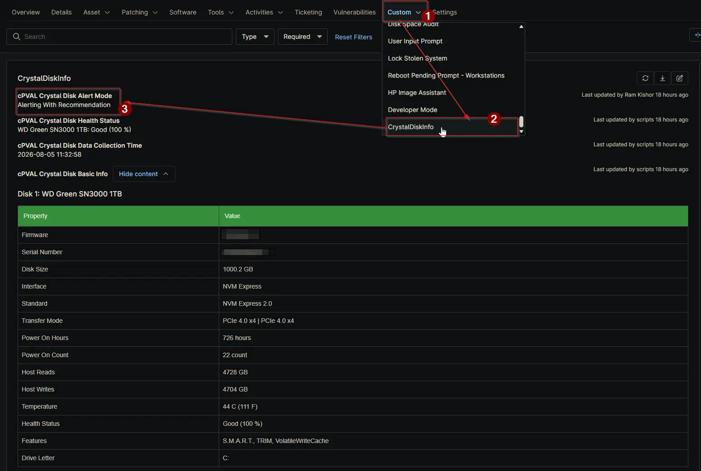

## Summary

The `cPVAL Crystal Disk Alert Mode` custom field controls how the [Proactive Disk Health Monitor](/docs/acd55d90-1704-440c-a92e-795c230ecf9a) solution responds to degraded drive health. It determines whether the solution only audits devices or also creates ConnectWise Manage tickets for Bad and Caution drive statuses, and whether replacement recommendations are included in the alert payload. The field can be set at the Organization, Location, and Device levels, with the device-level value taking priority.

## Details

| Label | Field Name | Example | Definition Scope | Type | Required | Default Value | Dropdown Options | Editable | Custom Field Tab |
| ----- | ---------- | ------- | ---------------- | ---- | -------- | ------------- | ---------------- | -------- | ---------------- |
| cPVAL Crystal Disk Alert Mode | cpvalCrystalDiskAlertMode | Alerting With Recommendation | Organization, Location, Device | Drop-down | No | | Disable, Audit Only, Alerting With Recommendation, Alerting Without Recommendation, Alert for Bad Status Only with Recommendation, Alert for Bad Status Only without Recommendation | Yes | CrystalDiskInfo |

Option behavior:

- **Disable** - Excludes the organization, location, or device from automated scheduled audits. Manual audit runs still work.
- **Audit Only** - Collects and stores disk health data in the custom fields without creating tickets.
- **Alerting With Recommendation** - Creates tickets for Bad and Caution drive statuses and includes replacement recommendations in the alert payload.
- **Alerting Without Recommendation** - Creates tickets for Bad and Caution drive statuses without replacement recommendations.
- **Alert for Bad Status Only with Recommendation** - Creates tickets only for Bad drive statuses, with replacement recommendations.
- **Alert for Bad Status Only without Recommendation** - Creates tickets only for Bad drive statuses, without replacement recommendations.

Precedence follows the standard NinjaOne hierarchy: a device-level value overrides the location value, and a location value overrides the organization value. Setting the field to Disable at any level opts that level out of automated monitoring while still allowing manual audits.

## Dependencies

- [Solution: Proactive Disk Health Monitor](/docs/acd55d90-1704-440c-a92e-795c230ecf9a)

## Custom Field Creation

- [Custom Field Configuration](https://github.com/ProVal-Tech/ninjarmm/blob/main/custom-fields/cpval-crystal-disk-alert-mode.toml)

## Sample Screenshot

## Changelog

### 2026-08-06

- Initial version of the document
