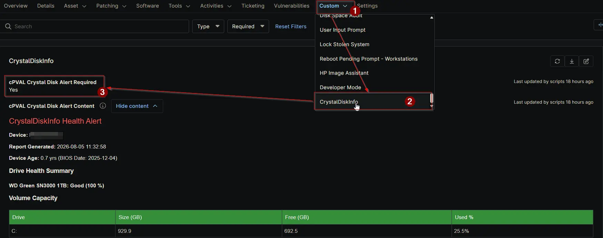

## Summary

The `cPVAL Crystal Disk Alert Required` custom field acts as a boolean flag indicating whether the device currently has a drive health condition that requires a support ticket. It is checked automatically by the [Proactive Disk Health Monitor](/docs/acd55d90-1704-440c-a92e-795c230ecf9a) solution based on the drive health status and the configured [cPVAL Crystal Disk Alert Mode](/docs/72297da9-ba7f-443f-a21a-f56afc638a3e).

## Details

| Label | Field Name | Example | Definition Scope | Type | Required | Default Value | Dropdown Options | Editable | Custom Field Tab |
| ----- | ---------- | ------- | ---------------- | ---- | -------- | ------------- | ---------------- | -------- | ---------------- |
| cPVAL Crystal Disk Alert Required | cpvalCrystalDiskAlertRequired | Checked | Device | Checkbox | No | Unchecked | N/A | No | CrystalDiskInfo |

This field is checked when an alert is required, and unchecked when no alert is needed. It is evaluated by the alerting compound condition to trigger automated ticket creation. When the box is checked, the alerting automation runs and generates a ticket. When the drive health recovers or no longer meets the alerting thresholds, the automation unchecks the box. Because the field is strictly managed by the automation, it is configured as read-only for technicians to prevent accidental modifications that could trigger false tickets or suppress legitimate alerts.

## Dependencies

- [Solution: Proactive Disk Health Monitor](/docs/acd55d90-1704-440c-a92e-795c230ecf9a)

## Custom Field Creation

- [Custom Field Configuration](https://github.com/ProVal-Tech/ninjarmm/blob/main/custom-fields/cpval-crystal-disk-alert-required.toml)

## Sample Screenshot

## Changelog

### 2026-08-06

- Initial version of the document
