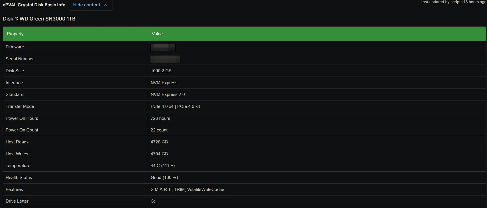

## Summary

The `cPVAL Crystal Disk Basic Info` custom field stores an HTML-formatted table of essential specifications and health summaries for every physical disk detected on the device. It is populated automatically by the [Proactive Disk Health Monitor](/docs/acd55d90-1704-440c-a92e-795c230ecf9a) solution during scheduled audits and provides technicians with a quick, readable overview of the hardware without needing to parse raw S.M.A.R.T. data.

## Details

| Label | Field Name | Example | Definition Scope | Type | Required | Default Value | Dropdown Options | Editable | Custom Field Tab |
| ----- | ---------- | ------- | ---------------- | ---- | -------- | ------------- | ---------------- | -------- | ---------------- |
| cPVAL Crystal Disk Basic Info | cpvalCrystalDiskBasicInfo | HTML formatted table | Device | WYSIWYG | No | None | N/A | No | CrystalDiskInfo |

This field captures high-level disk properties including the model, firmware, serial number, capacity, interface, transfer mode, power-on hours, power-on count, host reads and writes, temperature, overall health status, and assigned drive letters. Because the field is strictly managed by the automation, it is configured as read-only for technicians to prevent accidental modifications that could corrupt the HTML structure or break downstream alerting logic.

## Dependencies

- [Solution: Proactive Disk Health Monitor](/docs/acd55d90-1704-440c-a92e-795c230ecf9a)

## Custom Field Creation

- [Custom Field Configuration](https://github.com/ProVal-Tech/ninjarmm/blob/main/custom-fields/cpval-crystal-disk-basic-info.toml)

## Sample Screenshot

## Changelog

### 2026-08-06

- Initial version of the document
