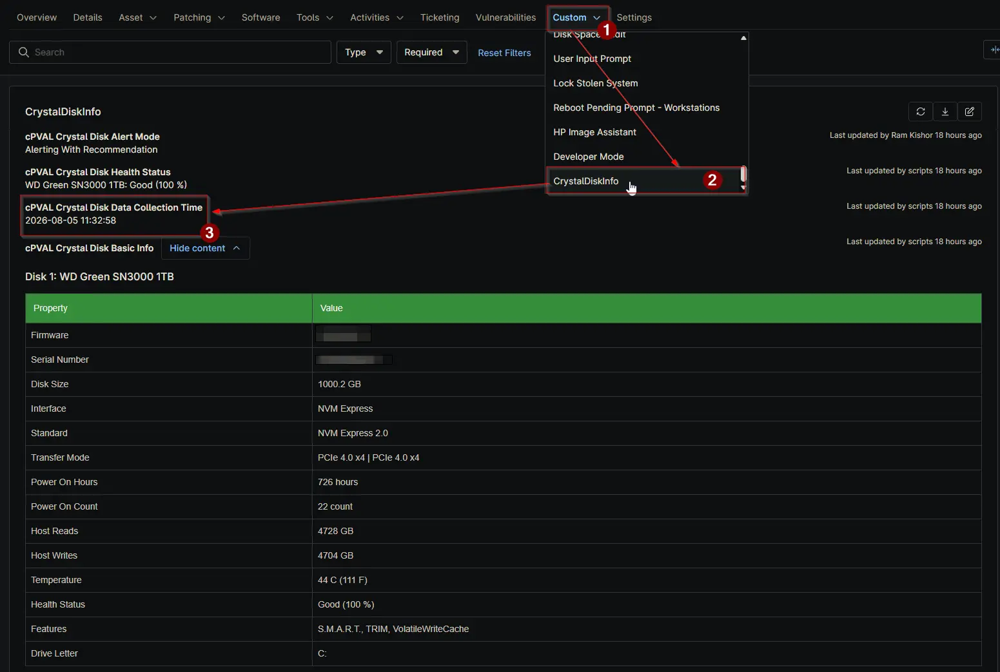

## Summary

The `cPVAL Crystal Disk Data Collection Time` custom field stores the exact timestamp of when the [Proactive Disk Health Monitor](/docs/acd55d90-1704-440c-a92e-795c230ecf9a) solution last collected disk health data on the device. This field helps technicians verify how recent the reported drive health and S.M.A.R.T. data is, and it is essential for troubleshooting stale reports or verifying that scheduled audits are running correctly.

## Details

| Label | Field Name | Example | Definition Scope | Type | Required | Default Value | Dropdown Options | Editable | Custom Field Tab |
| ----- | ---------- | ------- | ---------------- | ---- | -------- | ------------- | ---------------- | -------- | ---------------- |
| cPVAL Crystal Disk Data Collection Time | cpvalCrystalDiskDataCollectionTime | 2026-08-06 14:30:00 | Device | Text | No | None | N/A | No | CrystalDiskInfo |

This field is updated automatically at the start of every successful audit run. Because the field is strictly managed by the automation, it is configured as read-only for technicians to prevent accidental modifications that could mask stale data or break the audit tracking logic.

## Dependencies

- [Solution: Proactive Disk Health Monitor](/docs/acd55d90-1704-440c-a92e-795c230ecf9a)

## Custom Field Creation

- [Custom Field Configuration](https://github.com/ProVal-Tech/ninjarmm/blob/main/custom-fields/cpval-crystal-disk-data-collection-time.toml)

## Sample Screenshot

## Changelog

### 2026-08-06

- Initial version of the document
