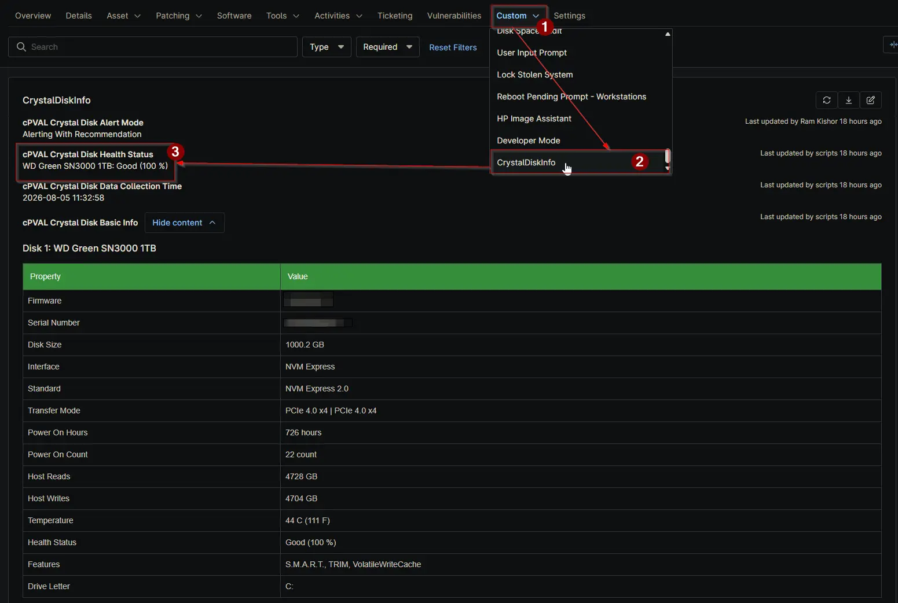

## Summary

The `cPVAL Crystal Disk Health Status` custom field stores a concise, comma-separated summary of the health status for every physical disk detected on the device. It is populated automatically by the [Proactive Disk Health Monitor](/docs/acd55d90-1704-440c-a92e-795c230ecf9a) solution during scheduled audits and serves as a primary indicator for fleet-wide drive health dashboards and alerting compound conditions.

## Details

| Label | Field Name | Example | Definition Scope | Type | Required | Default Value | Dropdown Options | Editable | Custom Field Tab |
| ----- | ---------- | ------- | ---------------- | ---- | -------- | ------------- | ---------------- | -------- | ---------------- |
| cPVAL Crystal Disk Health Status | cpvalCrystalDiskHealthStatus | SKHynix_HFS512GDE9X081N: Good (99 %), ST500DM002: Caution (45 %) | Device | Text | No | None | N/A | No | CrystalDiskInfo |

This field provides a quick, at-a-glance view of the overall storage health for a specific endpoint. When a drive degrades to a Caution or Bad state, the updated status in this field is evaluated by the alerting automation to determine if a support ticket should be generated. Because the field is strictly managed by the automation, it is configured as read-only for technicians to prevent accidental modifications that could break the alerting logic.

## Dependencies

- [Solution: Proactive Disk Health Monitor](/docs/acd55d90-1704-440c-a92e-795c230ecf9a)

## Custom Field Creation

- [Custom Field Configuration](https://github.com/ProVal-Tech/ninjarmm/blob/main/custom-fields/cpval-crystal-disk-health-status.toml)

## Sample Screenshot

## Changelog

### 2026-08-06

- Initial version of the document
