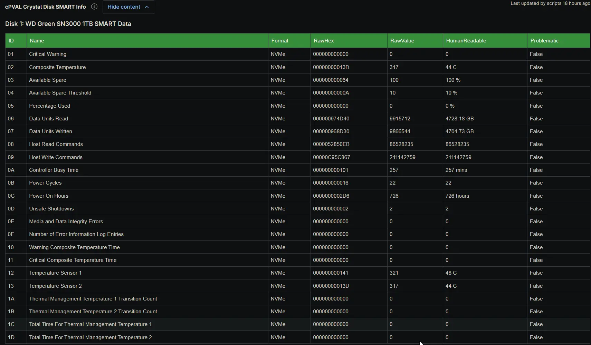

## Summary

The `cPVAL Crystal Disk SMART Info` custom field stores an HTML-formatted table of detailed S.M.A.R.T. attributes for every physical disk detected on the device. It is populated automatically by the [Proactive Disk Health Monitor](/docs/acd55d90-1704-440c-a92e-795c230ecf9a) solution during scheduled audits. The table columns adapt dynamically to the drive interface, and any attribute flagged as problematic is highlighted in red so technicians can identify physical drive degradation at a glance.

## Details

| Label | Field Name | Example | Definition Scope | Type | Required | Default Value | Dropdown Options | Editable | Custom Field Tab |
| ----- | ---------- | ------- | ---------------- | ---- | -------- | ------------- | ---------------- | -------- | ---------------- |
| cPVAL Crystal Disk SMART Info | cpvalCrystalDiskSmartInfo | HTML formatted S.M.A.R.T. table | Device | WYSIWYG | No | None | N/A | No | CrystalDiskInfo |

This field captures the full S.M.A.R.T. attribute set for each disk, including the attribute ID, name, and format, the normalized Current, Worst, and Threshold values for SATA drives, the raw hexadecimal and decimal values, human-readable conversions, and the Problematic flag. Rows where the Problematic flag is true are highlighted in red to draw attention to confirmed or early-warning drive defects. For a high-level hardware overview, refer to the [cPVAL Crystal Disk Basic Info](/docs/8d2b6f41-c73e-4a92-b5d8-6e1f3a9c4b27) field, and for the overall verdict, refer to the [cPVAL Crystal Disk Health Status](/docs/3f8a1c2e-9b47-4d5a-a6e3-1c9d84b2f7a5) field. Because the field is strictly managed by the automation, it is configured as read-only for technicians to prevent accidental modifications that could corrupt the HTML structure or break downstream alerting logic.

## Dependencies

- [Solution: Proactive Disk Health Monitor](/docs/acd55d90-1704-440c-a92e-795c230ecf9a)

## Custom Field Creation

- [Custom Field Configuration](https://github.com/ProVal-Tech/ninjarmm/blob/main/custom-fields/cpval-crystal-disk-smart-info.toml)

## Sample Screenshot

## Changelog

### 2026-08-06

- Initial version of the document
