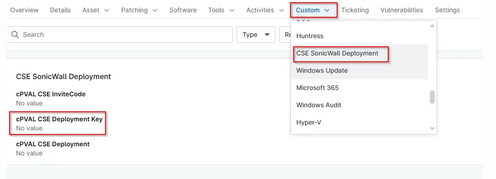

## Summary

cPVAL CSE Deployment Key used to register and associate the device with the appropriate Cloud Secure Edge deployment.

## Details

| Label | Field Name | Definition Scope | Type | Required | Default Value | Technician Permission | Automation Permission | API Permission | Description | Tool Tip | Footer Text |  Custom Field Tab Name |
| ----- | ---- | ---------------- | ---- | -------- | ------------- | --------------------- | --------------------- | -------------- | ----------- | -------- | ----------- | ----------- |
| cPVAL CSE Deployment Key | cpvalCseDeploymentKey | `Organization`, `Location`, `Device` | `Text` | True | | Editable | Read/Write | Read/Write | cPVAL CSE Deployment Key used to register and associate the device with the appropriate Cloud Secure Edge deployment. | Enter the CPVAL CSE Deployment Key provided by your administrator. | The Deployment Key is required for device enrollment and connection to the correct CSE environment. Ensure the value is entered correctly before proceeding. | CSE SonicWall Deployment |

## Dependencies

- [Solution - CSE SonicWall Deployment - NinjaOne](/docs/ac43f3f2-821f-4103-91c7-783e33f4aa0f)
- [Script - SonicWALL CSE App Deployment - Windows](/docs/7806076a-7298-40fa-a20a-e35f13143423)

## Custom Field Creation

- [Custom Field Configuration](https://github.com/ProVal-Tech/ninjarmm/blob/main/custom-fields/cpval-cse-deployment-key.toml)

## Sample Screenshot

## Changelog

### 2026-06-08

- Initial version of the document