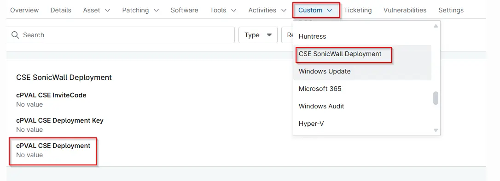

## Summary

Determines whether the SonicWall CSE deployment should be executed based on the configured deployment criteria.

## Details

| Label | Field Name | Definition Scope | Type | Required | Available Options | Technician Permission | Automation Permission | API Permission | Description | Tool Tip | Footer Text |  Custom Field Tab Name |
| ----- | ---- | ---------------- | ---- | -------- | ------------- | --------------------- | --------------------- | -------------- | ----------- | -------- | ----------- | ----------- |
| cPVAL CSE Deployment | cpvalCseDeployment | `Device`, `organization`, `Location` | `Drop-Down`| True | `Disabled`, `Windows`, `Windows Workstations`, `Windows Servers` | Editable | `Read/Write` | `Read/Write` | Determines whether the SonicWall CSE deployment should be executed based on the configured deployment criteria. | Choose the OS to enable deployment of the SonicWall CSE deployment. If set to 'Disable' for a location or device, it will be excluded from automated deployment. |CSE SonicWall auto-installation applies only to enabled locations and devices. Any item marked 'Disable' will be skipped during deployment. | CSE SonicWall Deployment |

## Dependencies

- [Solution - CSE SonicWall Deployment - NinjaOne](/docs/14e999fb-5dc4-45b8-96e6-40d05fa2119e)
- [Compound Condition - CSE SonicWall Deployment - Servers](/docs/0e96e9ab-436d-4d90-9bd5-59713edee157)
- [Compound Condition - CSE SonicWall Deployment - Workstations](/docs/ac43f3f2-821f-4103-91c7-783e33f4aa0f)

## Custom Field Creation

- [Custom Field Configuration](https://github.com/ProVal-Tech/ninjarmm/blob/main/custom-fields/cpval-cse-deployment.toml)

## Sample Screenshot

## Changelog

### 2026-06-08

- Initial version of the document