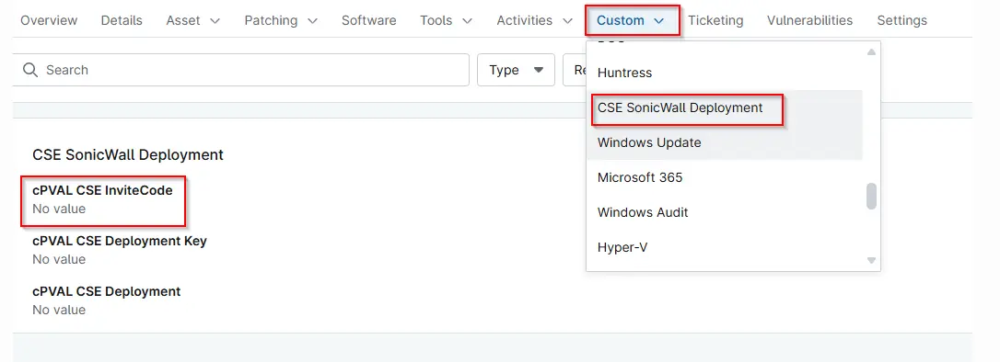

## Summary

Obtain the Invite Code from the SonicWall CSE Admin Portal. This value is required for device enrollment.

## Details

| Label | Field Name | Definition Scope | Type | Required | Default Value | Technician Permission | Automation Permission | API Permission | Description | Tool Tip | Footer Text |  Custom Field Tab Name |
| ----- | ---- | ---------------- | ---- | -------- | ------------- | --------------------- | --------------------- | -------------- | ----------- | -------- | ----------- | ----------- |
| cPVAL CSE InviteCode | cpvalCseInvitecode | `Organization`, `Location`, `Device` | `Text` | True | | Editable | Read/Write | Read/Write | Enter the CPVAL CSE Invite Code used to register the device with the SonicWall Cloud Secure Edge tenant. | Obtain the Invite Code from the SonicWall CSE Admin Portal. This value is required for device enrollment. | Leave blank only if the Invite Code will be provided during script execution. | CSE SonicWall Deployment |

## Dependencies

- [Solution - CSE SonicWall Deployment - NinjaOne](/docs/ac43f3f2-821f-4103-91c7-783e33f4aa0f)
- [Script - SonicWALL CSE App Deployment - Windows](/docs/7806076a-7298-40fa-a20a-e35f13143423)

## Custom Field Creation

- [Custom Field Configuration](https://github.com/ProVal-Tech/ninjarmm/blob/main/custom-fields/cpval-cse-invite-code.toml)

## Sample Screenshot

## Changelog

### 2026-06-08

- Initial version of the document