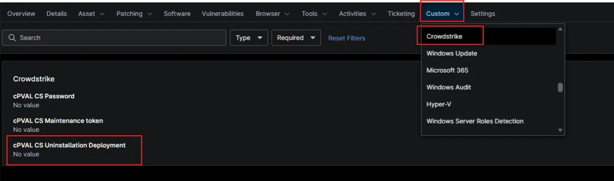

## Summary

Used within the compound condition to deploys the CrowdStrike uninstallation process to remove the CrowdStrike Falcon Sensor from targeted devices.

## Details

| Label | Field Name | Example | Definition Scope | Type | Required | Default Value | Dropdown Options | Editable | Custom Field Tab |
| ----- | ---------- | ------- | ---------------- | ---- | -------- | ------------- | ---------------- | -------- | ---------------- |
| cPVAL CS Uninstallation Deployment | cpvalCsUninstallationDeployment | -- | `Device`, `Location`, `Organization` | DropDown | False | `Disabled`, `Windows Workstations`, `Windows Servers`, `Windows` | -- |  Yes | Crowdstrike |

## Dependencies

- [Solution - Uninstall-Crowdstrike-Ninjaone](/docs/96ec2315-d8e2-4793-8db9-8d3f73803945)
- [Compound Condition - uninstall-CrowdStrike-Servers](/docs/dc76f6c4-2768-4e21-abe2-eb7e7bc05cb8)
- [Compound Condition - uninstall-CrowdStrike-Workstations](/docs/e18cdba3-96f3-4961-b516-d021752ada6f)

## Custom Field Creation

- [Custom Field Configuration](https://github.com/ProVal-Tech/ninjarmm/blob/main/custom-fields/cpval-csuninstallation-deployment.toml)

## Sample Screenshot

## Changelog

### 2026-10-09

Initial version of the script.