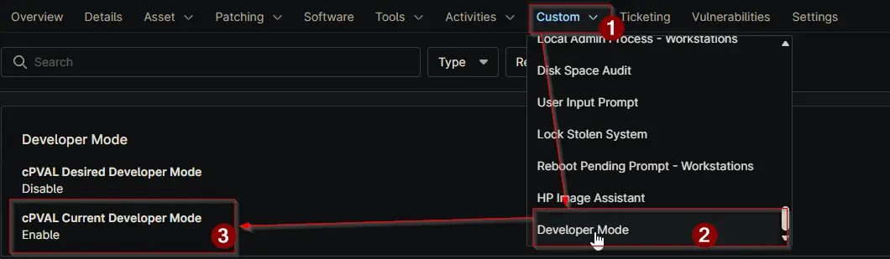

## Summary

This field shows the current Developer Mode state of a device. It is a read only field and is updated automatically by the [Manage Developer Mode](/docs/d1a715d8-715c-4f72-9f2a-a0d93c5c40af) automation.

When the automation runs in `Check` mode, it reads the current state from the device and stores it here. When running in `Enable` or `Disable` mode, the field is updated after the change is applied.

This field helps track what setting is actually present on the device at the time of the last run. It allows users to confirm whether Developer Mode is enabled or disabled without needing to manually check the device.

It is useful for reporting, auditing, and verifying that automation actions have been applied correctly.

## Details

| Label | Field Name | Definition Scope | Type | Required | Default Value | Available Options | Editable | Custom Field Tab Name |
| ----- | ---------- | ---------------- | ---- | -------- | ------------- | ----------------- | -------- | --------------------- |
| cPVAL Current Developer Mode | cpvalCurrentDeveloperMode | `Device` | Text | `False` | | | `False` | `Developer Mode` |

## Dependencies

- [Automation: Manage Developer Mode](/docs/d1a715d8-715c-4f72-9f2a-a0d93c5c40af)
- [Solution: Manage Developer Mode](/docs/3ab05cd9-d579-49d1-92c8-2b57870f5e7d)

## Custom Field Creation

[Custom Field Configuration](https://github.com/ProVal-Tech/ninjarmm/blob/main/custom-fields/cpval-current-developer-mode.toml)

## Sample Screenshot

## Changelog

### 2026-06-17

- Initial version of the document
