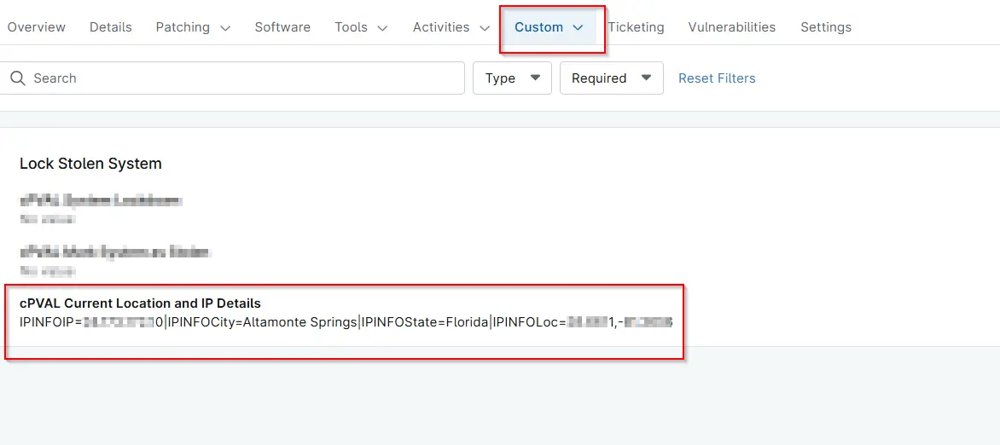

## Summary
It stores the Current IP address of the machine. Current city, Current state and Current coordinates of the machine according to the IP address. This custom field is populated by `Lock Stolen System` solution.

## Details

| Label | Field Name | Definition Scope | Type | Required | Default Value | Technician Permission | Automation Permission | API Permission | Description | Tool Tip | Footer Text |  Custom Field Tab Name |
| ----- | ---- | ---------------- | ---- | -------- | ------------- | --------------------- | --------------------- | -------------- | ----------- | -------- | ----------- | ----------- |
| cPVAL Current Location and IP Details | cpvalCurrentLocationAndIpDetails  | `Devices` | Text | No | |  Editable | Read_Write | Read_Write | It stores the Current IP address of the machine. Current city, Current state and Current coordinates of the machine according to the IP address. This custom field is populated by `Lock Stolen System` solution. | Stores the Current IP address of the machine. Current city, Current state and Current coordinates of the machine according to the IP address.| Stores the Current IP address of the machine. Current city, Current state and Current coordinates of the machine according to the IP address. | Lock Stolen System |

## Dependencies
- [Solution  - Lock Stolen System](/docs/13b4df99-df9b-4a57-bc0f-8675c68be028)

## Custom Field Creation

- [Custom Field Configuration](https://github.com/ProVal-Tech/ninjarmm/blob/main/custom-fields/cpval-current-location-and-ip-details.toml)

## Sample Screenshot
  
