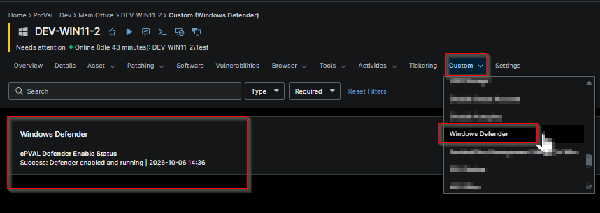

## Summary

This custom field stores the success or failure of the Enable Defender automation.

## Details

| Label | Field Name | Example | Definition Scope | Type | Required | Default Value | Dropdown Options | Editable | Custom Field Tab |
| ----- | ---------- | ------- | ---------------- | ---- | -------- | ------------- | ---------------- | -------- | ---------------- |
| cPVAL Defender Enable Status | cpvalDefenderEnableStatus | true | `Device` | Text | true | false |  |  | No | Windows Defender |

## Dependencies

- [Solution - Enable Defender](/docs/265e1888-ce5f-4d44-a5c4-6a64d578eb98)

## Custom Field Creation

- [Custom Field Configuration](https://github.com/ProVal-Tech/ninjarmm/blob/main/custom-fields/cpval-defender-enable-status.toml)

## Sample Screenshot

## Changelog

### 2026-10-07

- Initial version of the document