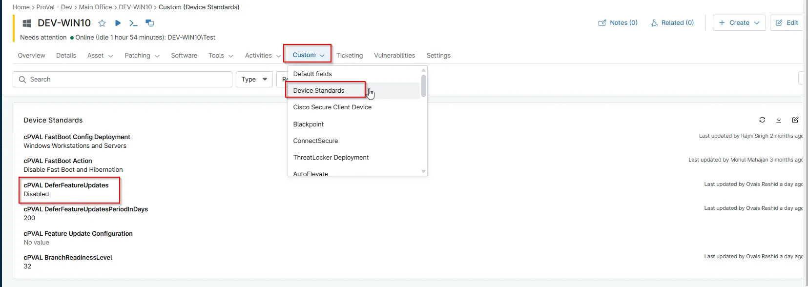

## Summary

This custom field is used to store the values for DeferFeatureUpdates. It contains two possible values: Enabled or Disabled.

## Details

| Label | Field Name | Definition Scope | Type | Required | Default Value | Technician Permission | Automation Permission | API Permission | Description | Tool Tip | Footer Text | Custom Field Tab Name |
| ----- | ---- | ---------------- | ---- | -------- | ------------- | --------------------- | --------------------- | -------------- | ----------- | -------- | ----------- | ----------- |
| cPVAL DeferFeatureUpdates | cpvalDeferfeatureupdates | `Device`, `Location`, `Organization` | `DropDown` | false | `Enabled`, `Disabled` | Editable | Read/Write | Read/Write | This custom field is used to store the values for DeferFeatureUpdates. It contains two possible values: 1 = Enabled, 2 = Disabled. | The value in the Custom Field must be set to either Enabled or Disabled. The script will then read this value and configure the corresponding setting accordingly (using 0 or 1 based on the Custom Field data). | The value in the Custom Field must be set to either Enabled or Disabled. The script will then read this value and configure the corresponding setting accordingly (using 0 or 1 based on the Custom Field data). | Device Standards |

## Dependencies

- [Solution - Device Standards](/docs/a0c383d4-699a-4bb8-af7f-c2a007747182)
- [Solution: Update Windows Deferral Settings](/docs/56e6b247-f80a-4bd8-b2e2-8cf44f76b7e1)
- [Automation: update windows deferral settings](/docs/5d4e1aa7-4ec8-4a7a-ba50-7a93366a232a)

## Custom Field Creation

- [Custom Field Configuration](https://github.com/ProVal-Tech/ninjarmm/blob/main/custom-fields/cpval-defer-feature-updates.toml)

## Sample Screenshot

## Changelog

### 2026-03-06

- Initial version of the document
