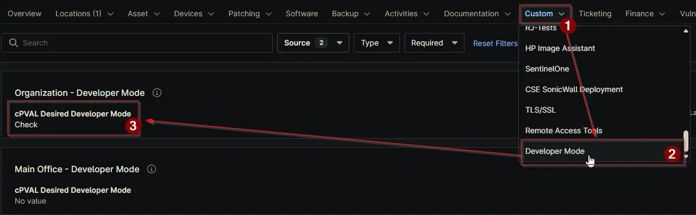

## Summary

This field controls how Developer Mode should be handled on devices. It is available at `Organization`, `Location`, and `Device` levels. The system follows a hierarchy where Device settings override Location, and Location settings override Organization.

There are four options. `None` will exclude the selected level from the automation, so no action is taken. `Check` will only read the current Developer Mode status from the device without making any changes. `Enable` will turn on Developer Mode on the device. `Disable` will turn off Developer Mode.

When the automation runs, it will follow the value set at the most specific level. For example, if a device has a value set directly, that value will be used even if different values are set at Location or Organization.

This field works together with the [cPVAL Current Developer Mode](/docs/9e05e3a1-05fb-4e33-a74c-f9df79ca5e1b) field. After each run, the system updates the current state based on the selected action.

## Details

| Label | Field Name | Definition Scope | Type | Required | Default Value | Available Options | Editable | Custom Field Tab Name |
| ----- | ---------- | ---------------- | ---- | -------- | ------------- | ----------------- | -------- | --------------------- |
| cPVAL Desired Developer Mode | cpvalDesiredDeveloperMode | `Organization`, `Location`, `Device` | Drop-down | `True` | | `None`, `Check`, `Enable`, `Disable` | `True` | `Developer Mode` |

## Dependencies

- [Solution: Manage Developer Mode](/docs/3ab05cd9-d579-49d1-92c8-2b57870f5e7d)

## Custom Field Creation

[Custom Field Configuration](https://github.com/ProVal-Tech/ninjarmm/blob/main/custom-fields/cpval-desired-developer-mode.toml)

## Sample Screenshot

## Changelog

### 2026-06-17

- Initial version of the document
