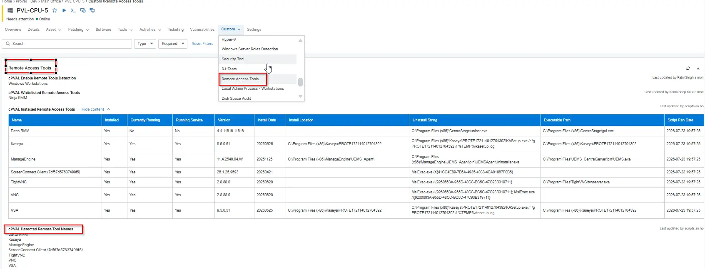

## Summary

This custom field stores the remote management applications list names gathered by the script [Installed Remote Tools Audit](/docs/8111fecc-61de-4c72-933c-b719351b7a1e).

## Details

| Label | Field Name | Definition Scope | Type | Required | Default Value | Available Options | Technician Permission | Automation Permission | API Permission | Description | Tool Tip | Footer Text | Custom Field Tab Name |
| ----- | ---- | ---------------- | ---- | -------- | ------------- | --------------------- | --------------------- | -------------- | ----------- | -------- | ----------- | ----------- | ----------- |
| cPVAL Detected Remote Tool Names | cpvalDetectedRemoteToolNames | `Organization`, `Location`, `Device` | Multi-Line | False | False | | Editable | Read_Write | Read_Write | Shows detected remote access tool names. | This field is automatically populated by the Remote Tool Audit script. It contains a list of remote control software names (e.g., AnyDesk, TeamViewer) detected on this device. It can be used for dynamic grouping and exports. | Populated automatically during the Remote Access Tool audit. | Remote Access Tools |

## Dependencies

- [Solution - Installed Remote Access Tool Audit](/docs/eae2fab9-4697-4e1e-ad8f-93f8a09d7056)
- [Script - Installed Remote Tools Audit](/docs/8111fecc-61de-4c72-933c-b719351b7a1e)

## Custom Field Creation

- [Custom Field Configuration](https://github.com/ProVal-Tech/ninjarmm/blob/main/custom-fields/cpval-detected-remote-control-names.toml)

## Sample Screenshot

## Changelog

### 2026-07-23

- Initial version of the document