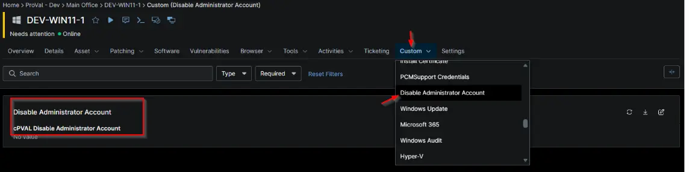

## Summary

Used within the compound condition to determine whether the Disable Administrator solution needs to be run on the Organization.

## Details

| Label | Field Name | Example | Definition Scope | Type | Required | Default Value | Dropdown Options | Editable | Custom Field Tab |
| ----- | ---------- | ------- | ---------------- | ---- | -------- | ------------- | ---------------- | -------- | ---------------- |
| `cPVAL Disable Administrator Account` | `cpvalDisableAdministratorAccount` | -- | `Device`, `Organization`, `Location` | `Drop-Down` | False | --- | `Disabled`, `Windows Workstation`, `Windows Servers`, `Windows` | True | `Disable Administrator Account` |

## Dependencies

- [Solution - Disable Administrator Account](/docs/c3553e8f-bacf-4b6c-a53f-87cd615d0260)

## Custom Field Creation

- [Custom Field Configuration](https://github.com/ProVal-Tech/ninjarmm/blob/main/custom-fields/cpval-disable-administrator-account.toml)

## Sample Screenshot

## Changelog

### 2026-10-02

- Initial Version of the document.
