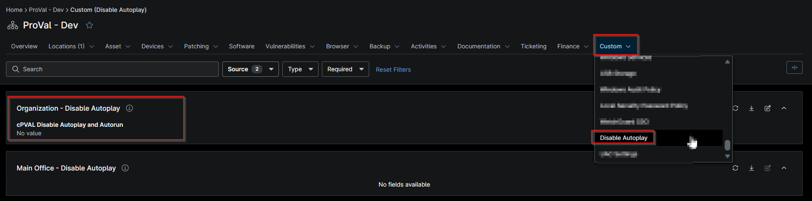

## Summary

Select this custom field to apply settings that disable AutoRun and AutoPlay policies across the client's Windows devices.

## Details

| Label | Field Name | Example | Definition Scope | Type | Required | Default Value | Dropdown Options | Editable | Custom Field Tab |
| ----- | ---------- | ------- | ---------------- | ---- | -------- | ------------- | ---------------- | -------- | ---------------- |
| cPVAL Disable AutoPlay and AutoRun | cpvalDisableAutoplayAndAutorun | true | `Organization` | false | false |  | Yes | Disable AutoPlay |

## Dependencies

- [Solution - Disable AutoPlay and AutoRun](/docs/19b3d384-3d3d-42fc-80ab-1deef3f8af09)

## Custom Field Creation

- [Custom Field Configuration](https://github.com/ProVal-Tech/ninjarmm/blob/main/custom-fields/cpval-disable-autoplay-and-autorun.toml)

## Sample Screenshot

## Changelog

### 2026-10-08

- Initial version of the document
