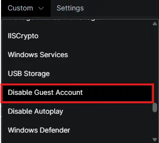
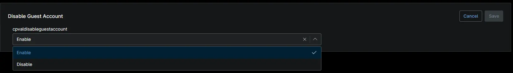

## Summary

Drop-down to enable or disable the Guest Account.

## Details

| Label | Field Name | Example | Definition Scope | Type | Required | Default Value | Dropdown Options | Editable | Custom Field Tab |
| ----- | ---------- | ------- | ---------------- | ---- | -------- | ------------- | ---------------- | -------- | ---------------- |
| `cPVAL Disable Guest Account` | `cpvaldisableguestaccount` | 'Enable' | `Organization` | `Drop-down` | False | -- | `Enable`, `Disable` | True | `Disable Guest Account` |

## Dependencies

- [Script - Disable Guest Accounts](/docs/89454fe4-a6b8-4e6a-8b47-a59f23128e07)
- [Solution - Disable Guest Account](/docs/5e9750da-82c2-4f0a-a6a0-894412269e53)

## Custom Field Creation

- [Custom Field Configuration](https://github.com/ProVal-Tech/ninjarmm/blob/main/custom-fields/cpval-disable-guest-account.toml)

## Sample Screenshot

## Changelog

### 2026-10-08

- Initial version of the document