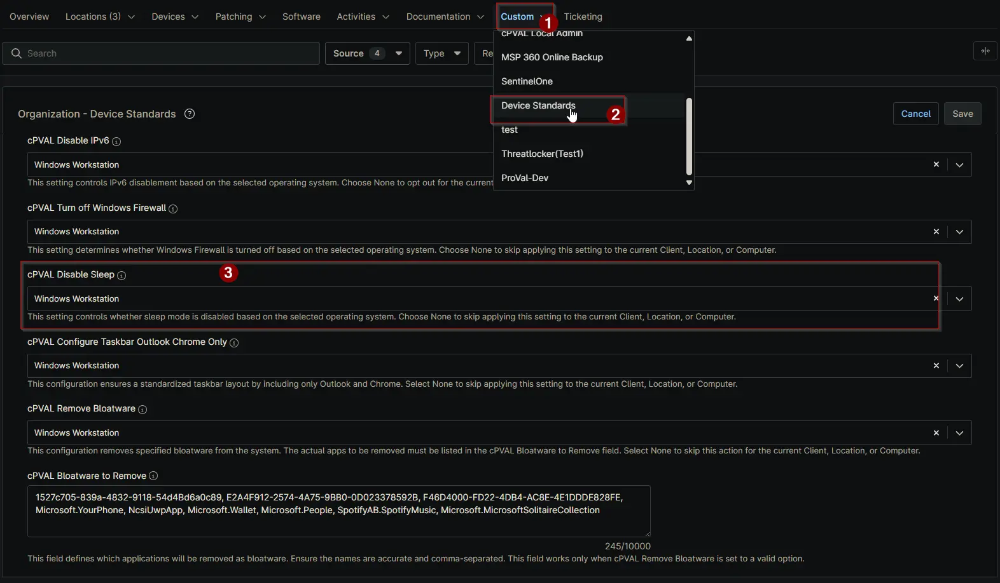

## Summary

This custom field controls whether sleep mode is disabled based on the selected operating system. Choose None to skip applying this setting to the current Client, Location, or Computer.

## Details

| Label | Field Name | Definition Scope | Type | Required | Default Value | Available Options | Technician Permission | Automation Permission | API Permission | Description | Tool Tip | Footer Text | Custom Field Tab Name |
| ----- | ---- | ---------------- | ---- | -------- | ------------- | --------------------- | --------------------- | -------------- | ----------- | -------- | ----------- | ----------- | ----------- |
| cPVAL Disable Sleep | cpvalDisableSleep | `Organization`, `Location`, `Device` | Drop-down | False | | `None`, `Windows Workstation and Windows Server`, `Windows Workstation`, `Windows Server` | Editable | Read_Write | Read_Write | Select the operating system(s) for which sleep mode should be disabled. Choose None to exclude the Client, Location, or Computer from this configuration. | Use this dropdown to specify the OS where sleep mode should be turned off. Selecting None will retain the current sleep settings for the selected entity. | This setting controls whether sleep mode is disabled based on the selected operating system. Choose None to skip applying this setting to the current Client, Location, or Computer. | Device Standards |

## Dependencies

- [Solution - Disable Sleep](/docs/)
- [Solution - Device Standards](/docs/)

## Custom Field Creation

[Custom Field Configuration](https://github.com/ProVal-Tech/ninjarmm/blob/main/custom-fields/cpval-disable-sleep.toml)

## Sample Screenshot

