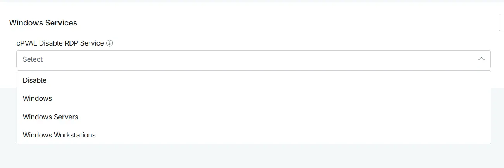

## Summary

Custom Field to choose operating system to disable the UPnP Device Host (upnphost) service on Windows devices.

## Details

| Label | Field Name | Example | Definition Scope | Type | Required | Default Value | Dropdown Options | Editable | Custom Field Tab |
| ----- | ---------- | ------- | ---------------- | ---- | -------- | ------------- | ---------------- | -------- | ---------------- |
| cPVAL Disable UPnP Service | cpvalDisableUpnpService | `Organization`, `Location`, `Device` | Drop-down | False | | <ul><li>Disable</li><li>Windows Workstations</li><li>Windows Servers</li><li>Windows</li></ul> | Editable | Read_Write | Read_Write | Windows Services |

## Dependencies

- [Solution - Disable UPnP Service](/docs/70d10692-83c6-4c25-b546-9beadaba5468)

## Custom Field Creation

- [Custom Field Configuration](https://github.com/ProVal-Tech/ninjarmm/blob/main/custom-fields/cpval-disable-upnp-service.toml)

## Sample Screenshot

## Changelog

### 2026-10-01

- Initial version of the document
