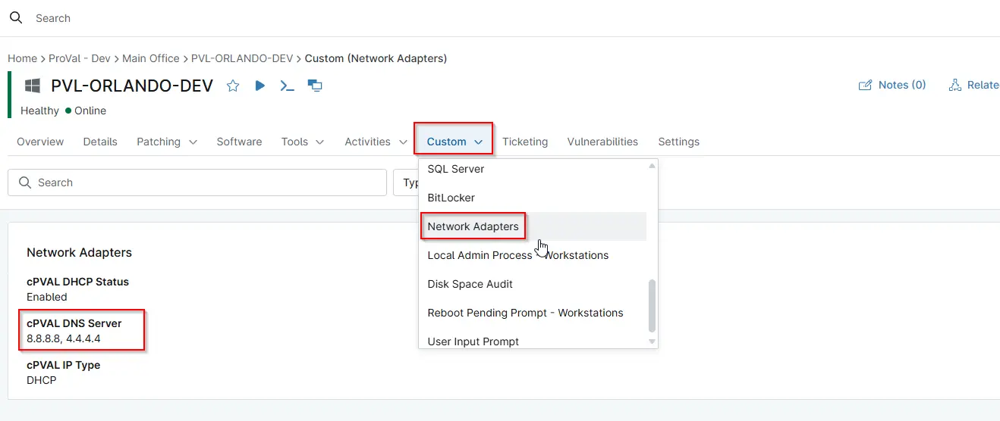

## Summary

Displays the DNS server address configured on the active network adapter. Shows the primary and secondary DNS servers assigned to the network interface.

## Details

| Label | Field Name | Definition Scope | Type | Required | Default Value | Technician Permission | Automation Permission | API Permission | Description | Tool Tip | Footer Text | Custom Field Tab Name |
| ----- | ---- | ---------------- | ---- | -------- | ------------- | --------------------- | --------------------- | -------------- | ----------- | -------- | ----------- | ----------- |
| cPVAL DNS Server | cpvalDnsServer | `Device` | Text | False | -- | Editable | Read/Write | Read/Write | Displays the DNS server address configured on the active network adapter. | Shows the primary and secondary DNS servers assigned to the network interface. | Collected automatically from the system’s active network adapter settings. | Network Adapters |

## Dependencies

- [Script - Get - Network Adapter details](/docs/50ff2168-46f2-4c9b-8ccc-0d3671178267)
- [Solution - Network Adapter Details](/docs/81d8fa31-72c7-4339-a107-4a41a3e489f5)

## Custom Field Creation

- [Custom Field Configuration](https://github.com/ProVal-Tech/ninjarmm/blob/main/custom-fields/cpval-dns-server.toml)

## Sample Screenshot

