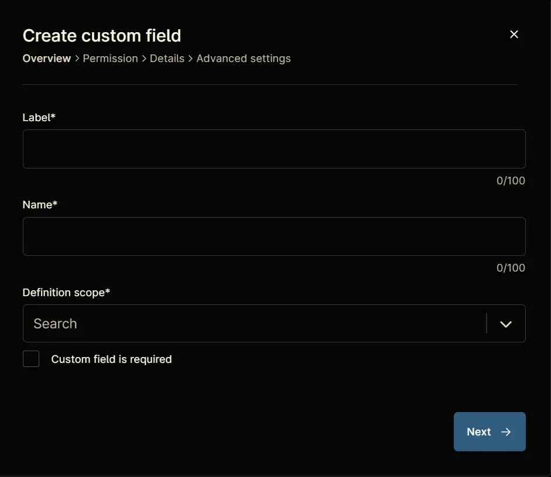
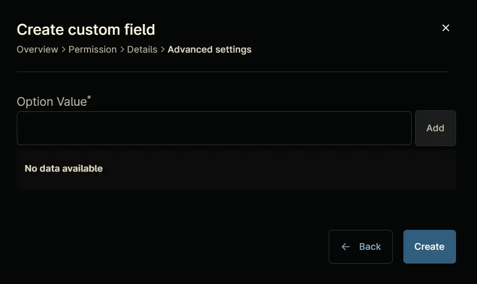
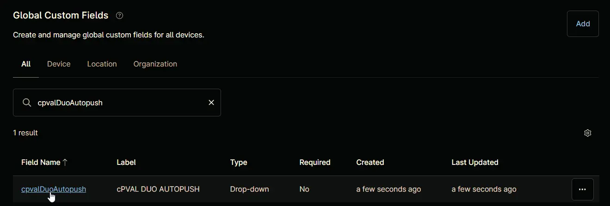
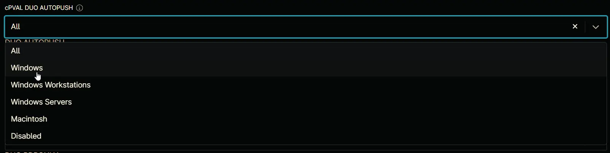

## Summary

If enabled, this option will automatically send a push request to the user's device when they attempt to log in. The default value is blank, which requires the user to manually request the push.

## Details

| Label | Field Name | Definition Scope | Type | Option Value | Default Value | Required  | Technician Permission | Automation Permission | API Permission | Description | Tool Tip | Footer Text |
| ----- | ---------- | ---------------- | ---- | ------------ | ------------- | --------- | --------------------- | --------------------- | -------------- | ----------- | -------- | ----------- |
| cPVAL DUO AUTOPUSH | cpvalDuoAutopush | Organization | drop-down | `All`, `Windows`, `Windows Workstations`, `Windows Servers`, `Macintosh`, `Disabled` | `Disabled` | False | Editable | Read/Write | Read/Write | If enabled, this option will automatically send a push request to the user's device when they attempt to log in. The default value is blank, which requires the user to manually request the push. | Select the platform to enable DUO AutoPush | DUO AUTOPUSH |

## Custom Field Creation

### Step 1

Navigate to the `Administration` menu, then proceed to `Devices` and select `Global Custom Fields`.  

### Step 2

Locate the `Add` button on the right-hand side of the screen and click on it.  
  

### Step 3

After clicking the `Add` button, select the `Field` button that appears.  

The following Pop-up screen will appear:  

### Step 4

**Custom Field Type:** `Drop-down`

Select `Drop-down` for the `Custom field type` and click `Continue` to proceed.  

The following Pop-up screen will appear:  

### Step 5

Set the following details in the `Overview` section and click the `Next` button.

**Label:** `cPVAL DUO AUTOPUSH`  
**Name:** `cpvalDuoAutopush`  
**Definition Scope:** `Organization`  
**Custom field is required:** `<Leave it unchecked>`

Clicking the `Next` button will take you to the `Permission` section.  

### Step 6

Set the following details in the `Permission` section and click the `Next` button.  

**Technician:** `Editable`  
**Automation:** `Read/Write`  
**API:** `Read/Write`

Clicking the `Next` button will take you to the details tab.  

### Step 7

Fill in the following information in the `Details` section and click the `Next` button.

**Description:** `If enabled, this option will automatically send a push request to the user's device when they attempt to log in. The default value is blank, which requires the user to manually request the push.`  
**Tooltip Text:** `Select the platform to enable DUO AutoPush`  
**Footer Text:** `DUO AUTOPUSH`

Clicking the `Next` button will take you to the `Advanced Settings` tab.  

### Step 8

Configure the following options in the specified order. To add an option, paste it and click the `Add` button:

- All
- Windows  
- Windows Workstations
- Windows Servers
- Macintosh
- Disabled

Click the `Create` button to create the `Custom Field`.  

## Completed Custom Field

## Example

