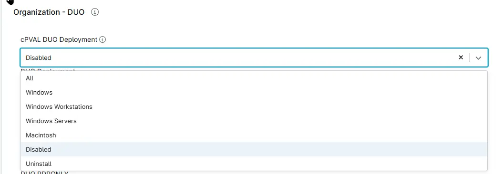

## Summary

Select the required platform to enable Duo to auto-deploy.

## Details

| Label | Field Name | Definition Scope | Type | Option Value | Default Value | Required  | Technician Permission | Automation Permission | API Permission | Description | Tool Tip | Footer Text | Custom Field Tab Name |
| ----- | ---------- | ---------------- | ---- | ------------ | ------------- | --------- | --------------------- | --------------------- | -------------- | ----------- | -------- | ----------- | ----------- |
| cPVAL DUO Deployment | cpvalDuoDeployment | Organization | drop-down | `All`, `Windows`, `Windows Workstations`, `Windows Servers`, `Macintosh`, `Disabled`, `Uninstall` | `Disabled` | False | Editable | Read/Write | Read/Write | Select the required platform to enable Duo to auto-deploy. Select Uninstall to Uninstall Duo on both mac and windows machines if its already installed. | Select the required platform to enable Duo to auto-deploy. Select Uninstall to Uninstall Duo on both mac and windows machines if its already installed. | DUO Deployment | DUO | 

## Dependencies

- [Solution - Duo Deployment](/docs/a11cd829-a491-4cb1-a7c1-3f56fa8c7557)

## Custom Field Creation

- [Custom Field Configuration](https://github.com/ProVal-Tech/ninjarmm/blob/main/custom-fields/cpval-duo-deployment.toml)

## Sample Screenshot

## Changelog

### 2026-05-25

* Added an uninstall option to the custom field, allowing the same field to be used for both installation and uninstallation actions.
* Updated the documentation to align with the new documentation format and standards.

### 2025-04-14

- Initial version of the document
