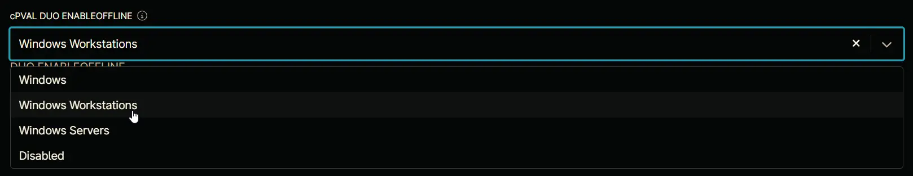

## Summary

If enabled, it will control whether offline access is permitted. For Duo, offline access allows users to authenticate without a real-time connection to Duo’s service, usually by using previously generated passcodes or other offline methods.

## Details

| Label | Field Name | Definition Scope | Type | Option Value | Default Value | Required  | Technician Permission | Automation Permission | API Permission | Description | Tool Tip | Footer Text | Custom Field Tab Name | 
| ----- | ---------- | ---------------- | ---- | ------------ | ------------- | --------- | --------------------- | --------------------- | -------------- | ----------- | -------- | ----------- | ---------- | 
| cPVAL DUO ENABLEOFFLINE | cpvalDuoEnableoffline | Organization | drop-down | `Windows`, `Windows Workstations`, `Windows Servers`,  `Disabled` | | False | Editable | Read/Write | Read/Write | If enabled, it will control whether offline access is permitted. For Duo, offline access allows users to authenticate without a real-time connection to Duo’s service, usually by using previously generated passcodes or other offline methods. | Select the platform to enable DUO ENABLEOFFLINE. It is enabled by default. | DUO ENABLEOFFLINE | DUO |

## Dependencies

- [Solution - Duo Deployment](/docs/a11cd829-a491-4cb1-a7c1-3f56fa8c7557)

## Custom Field Creation

- [Custom Field Configuration](https://github.com/ProVal-Tech/ninjarmm/blob/main/custom-fields/cpval-duo-enableoffline.toml)

## Sample Screenshot

## Changelog

### 2026-05-28

* Updated the documentation to align with the new documentation format and standards.

### 2025-04-14

- Initial version of the document
