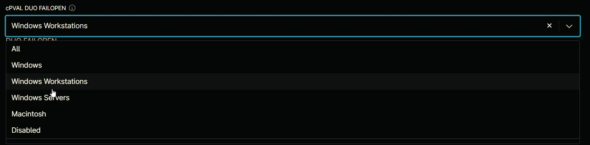

## Summary

This determines the behavior when Duo's service cannot be reached. If enabled, the system will allow the user to log in (fail open). If disabled, the system will deny access (fail closed). The default is to fail closed.

## Details

| Label | Field Name | Definition Scope | Type | Option Value | Default Value | Required  | Technician Permission | Automation Permission | API Permission | Description | Tool Tip | Footer Text |  Custom Field Tab Name | 
| ----- | ---------- | ---------------- | ---- | ------------ | ------------- | --------- | --------------------- | --------------------- | -------------- | ----------- | -------- | ----------- | -------- |
| cPVAL DUO FAILOPEN | cpvalDuoFailopen | Organization | drop-down | `All`, `Windows`, `Windows Workstations`, `Windows Servers`, `Macintosh`, `Disabled` | `Disabled` | False | Editable | Read/Write | Read/Write | This determines the behavior when Duo's service cannot be reached. If enabled, the system will allow the user to log in (fail open). If disabled, the system will deny access (fail closed). The default is to fail closed. | Select the platform to enable DUO FailOpen | DUO FAILOPEN | DUO |

## Dependencies

- [Solution - Duo Deployment](/docs/a11cd829-a491-4cb1-a7c1-3f56fa8c7557)

## Custom Field Creation

- [Custom Field Configuration](https://github.com/ProVal-Tech/ninjarmm/blob/main/custom-fields/cpval-duo-failopen.toml)

## Sample Screenshot

## Changelog

### 2026-05-28

* Updated the documentation to align with the new documentation format and standards.

### 2025-04-14

- Initial version of the document
