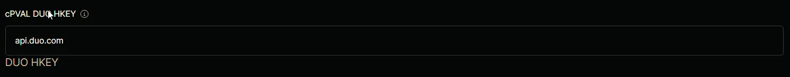

## Summary

The Host Key or API Hostname, which is the endpoint in Duo’s service that your application communicates with. This hostname is also found in the Duo Admin Panel and is necessary for setting up the integration.

## Details

| Label | Field Name | Definition Scope | Type | Required  | Technician Permission | Automation Permission | API Permission | Description | Tool Tip | Footer Text | Custom Field Tab Name |
| ----- | ---------- | ---------------- | ---- | --------- | --------------------- | --------------------- | -------------- | ----------- | -------- | ----------- | ------ |
| cPVAL DUO HKEY | cpvalDuoHkey | Organization | Text | False | Editable | Read/Write | Read/Write | The Host Key or API Hostname, which is the endpoint in Duo’s service that your application communicates with. This hostname is also found in the Duo Admin Panel and is necessary for setting up the integration. | Provide the API hostname from the Duo Admin Panel. | DUO HKEY | DUO |

## Dependencies

- [Solution - Duo Deployment](/docs/a11cd829-a491-4cb1-a7c1-3f56fa8c7557)

## Custom Field Creation

- [Custom Field Configuration](https://github.com/ProVal-Tech/ninjarmm/blob/main/custom-fields/cpval-duo-hkey.toml)

## Sample Screenshot

## Changelog

### 2026-05-25

* Updated the documentation to align with the new documentation format and standards.

### 2025-04-14

- Initial version of the document
