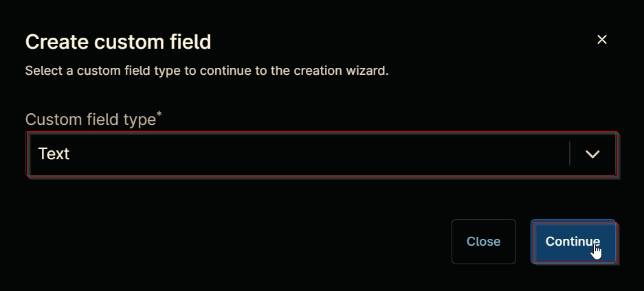
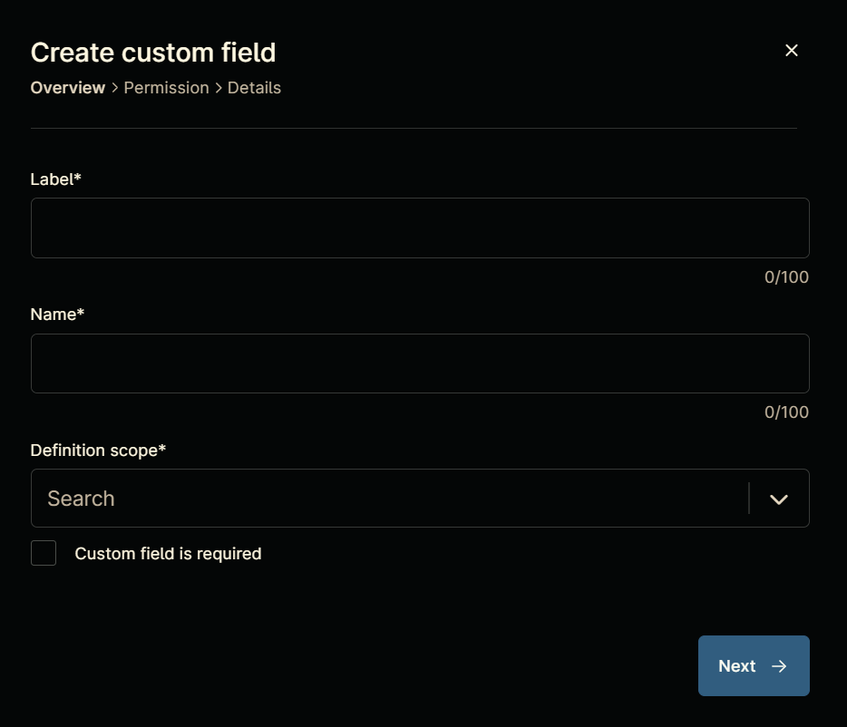
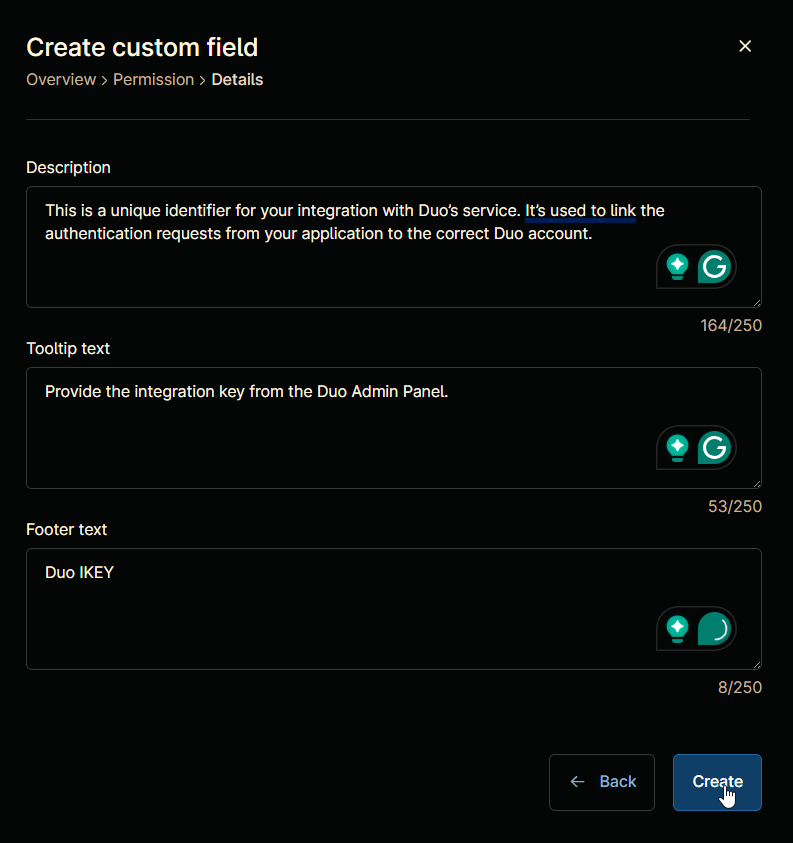
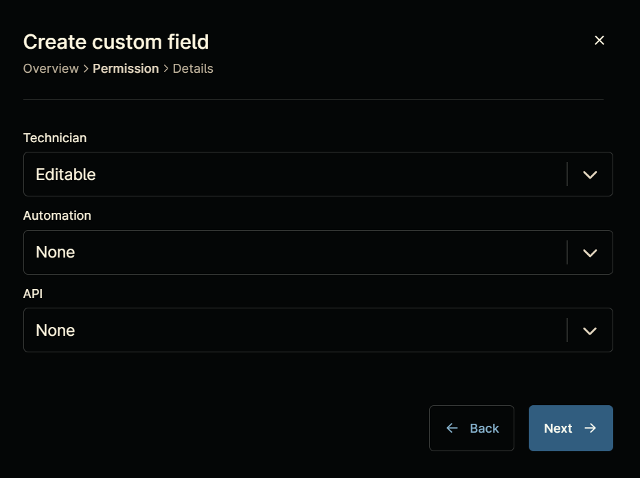
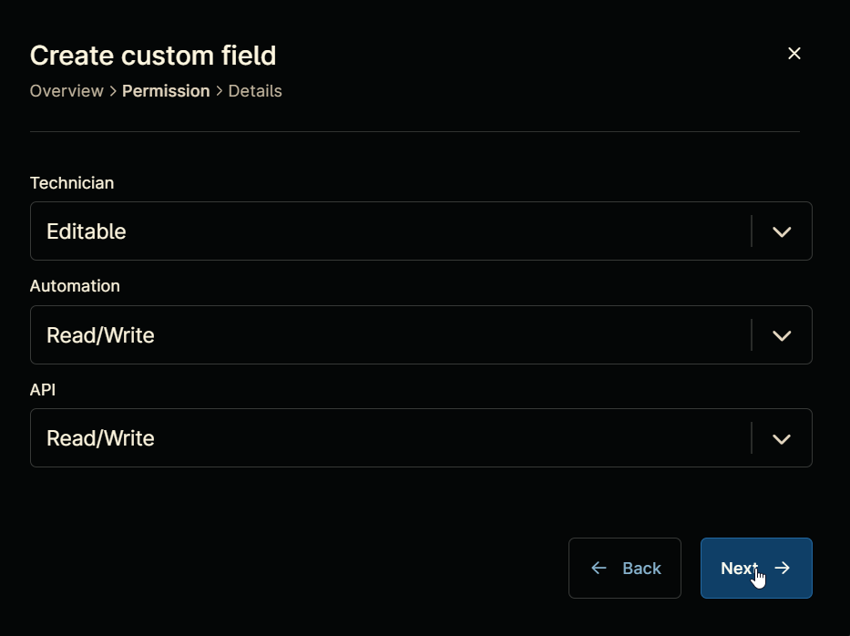
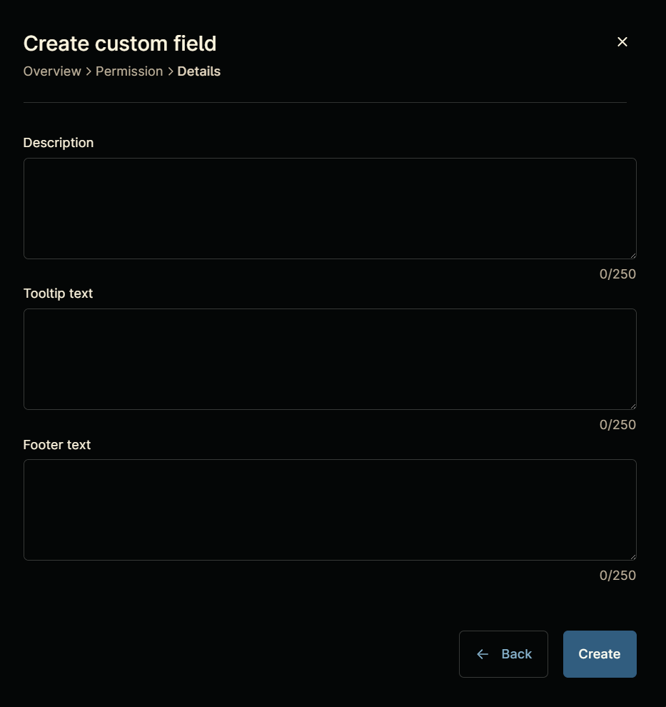
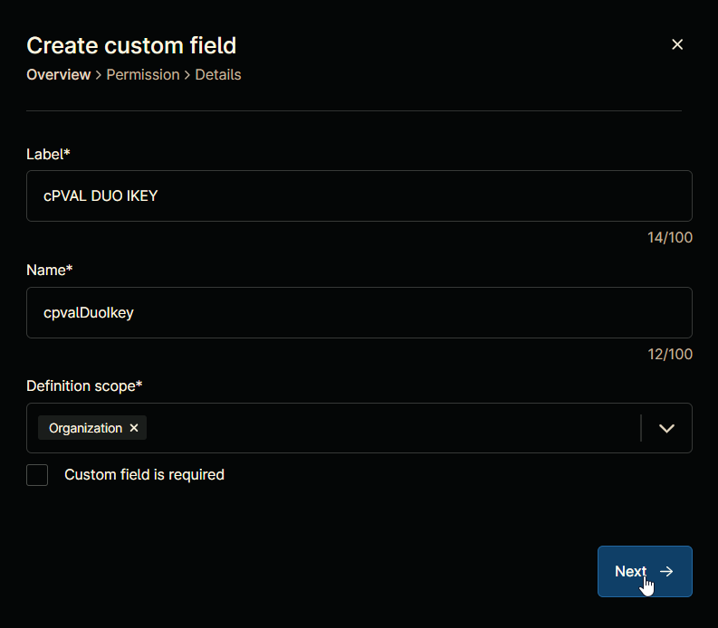
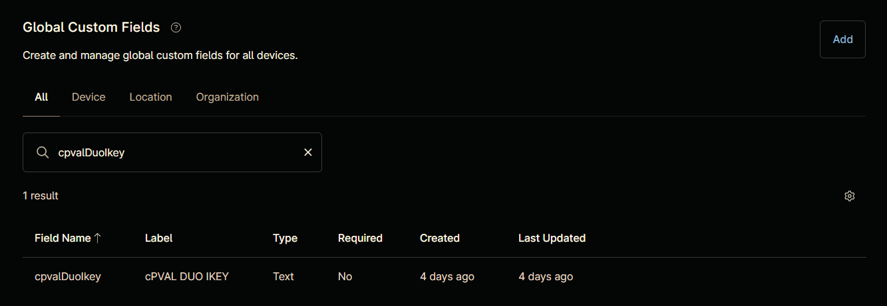
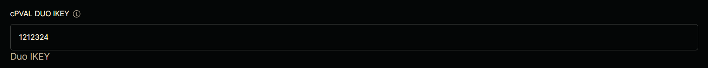

## Summary

This is a unique identifier for your integration with Duo’s service. It’s used to link the authentication requests from your application to the correct Duo account.

## Details

| Label | Field Name | Definition Scope | Type | Required  | Technician Permission | Automation Permission | API Permission | Description | Tool Tip | Footer Text |
| ----- | ---------- | ---------------- | ---- | --------- | --------------------- | --------------------- | -------------- | ----------- | -------- | ----------- |
| cPVAL DUO IKEY | cpvalDuoIkey | Organization | Text | False | Editable | Read/Write | Read/Write | This is a unique identifier for your integration with Duo’s service. It’s used to link the authentication requests from your application to the correct Duo account. | Provide the integration key from the Duo Admin Panel. | DUO IKEY |

## Custom Field Creation

### Step 1

Navigate to the `Administration` menu, then proceed to `Devices` and select `Global Custom Fields`.  

### Step 2

Locate the `Add` button on the right-hand side of the screen and click on it.  
  

### Step 3

After clicking the `Add` button, select the `Field` button that appears.  

The following Pop-up screen will appear:  

### Step 4

**Custom Field Type:** `Text`

Select `Text` for the `Custom field type` and click `Continue` to proceed.  

The following Pop-up screen will appear:  

### Step 5

Set the following details in the `Overview` section and click the `Next` button.

**Label:** `cPVAL DUO IKEY`  
**Name:** `cpvalDuoIkey`  
**Definition Scope:** `Organization`  
**Custom field is required:** `<Leave it unchecked>`

Clicking the `Next` button will take you to the `Permission` section.  

### Step 6

Set the following details in the `Permission` section and click the `Next` button.  

**Technician:** `Editable`  
**Automation:** `Read/Write`  
**API:** `Read/Write`

Clicking the `Next` button will take you to the details tab.  

### Step 7

Fill in the following information in the `Details` section and click the `Create` button to create the `Custom Field`.

**Description:** `This is a unique identifier for your integration with Duo’s service. It’s used to link the authentication requests from your application to the correct Duo account.`  
**Tooltip Text:** `Provide the integration key from the Duo Admin Panel.`  
**Footer Text:** `DUO IKEY`

## Completed Custom Field

## Example

