## Summary

When enabled, Duo authentication is required only for remote logins via RDP. If not, Duo authentication is required for both console and RDP logins. The default is disabled, meaning Duo protects both.

## Details

| Label | Field Name | Definition Scope | Type | Option Value | Default Value | Required  | Technician Permission | Automation Permission | API Permission | Description | Tool Tip | Footer Text |
| ----- | ---------- | ---------------- | ---- | ------------ | ------------- | --------- | --------------------- | --------------------- | -------------- | ----------- | -------- | ----------- |
| cPVAL DUO RDPONLY | cpvalDuoRdponly | Organization | drop-down | `Windows`, `Windows Workstations`, `Windows Servers`,  `Disabled` | Disabled | False | Editable | Read/Write | Read/Write | When enabled, Duo authentication is required only for remote logins via RDP. If not, Duo authentication is required for both console and RDP logins. The default is disabled, meaning Duo protects both. | Select the platform to enable DUO RDPOnly | DUO RDPONLY |

## Custom Field Creation

### Step 1

Navigate to the `Administration` menu, then proceed to `Devices` and select `Global Custom Fields`.  

### Step 2

Locate the `Add` button on the right-hand side of the screen and click on it.  
  

### Step 3

After clicking the `Add` button, select the `Field` button that appears.  

The following Pop-up screen will appear:  

### Step 4

**Custom Field Type:** `Drop-down`

Select `Drop-down` for the `Custom field type` and click `Continue` to proceed.  
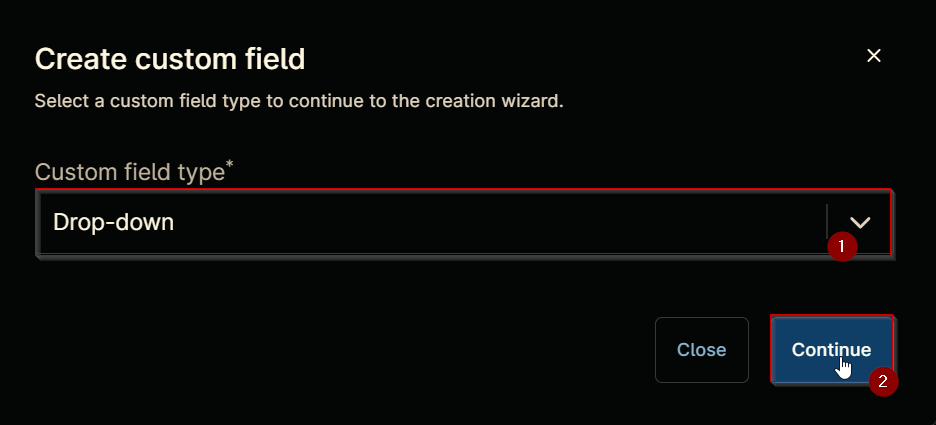

The following Pop-up screen will appear:  
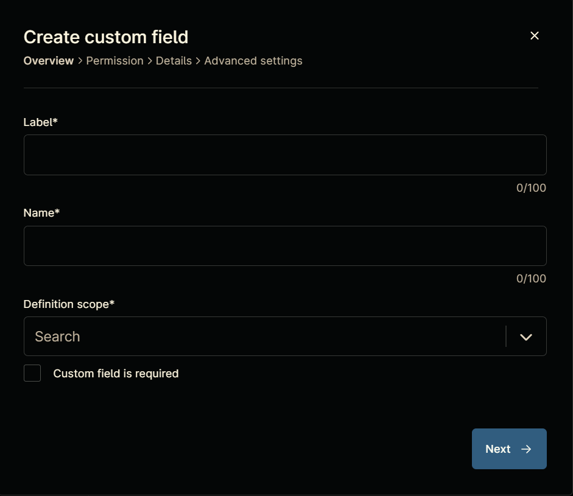

### Step 5

Set the following details in the `Overview` section and click the `Next` button.

**Label:** `cPVAL DUO RDPONLY`  
**Name:** `cpvalDuoRdponly`  
**Definition Scope:** `Organization`  
**Custom field is required:** `<Leave it unchecked>`

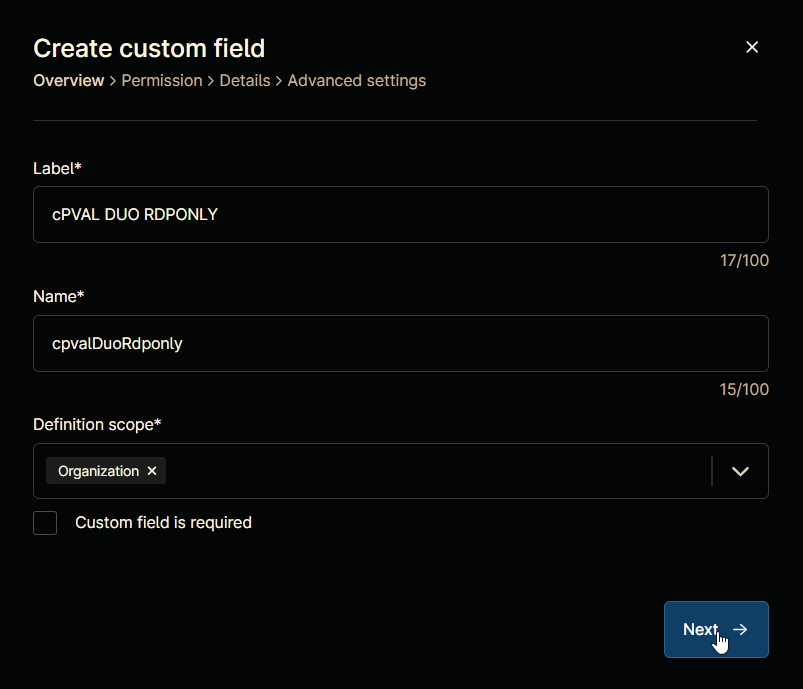

Clicking the `Next` button will take you to the `Permission` section.  
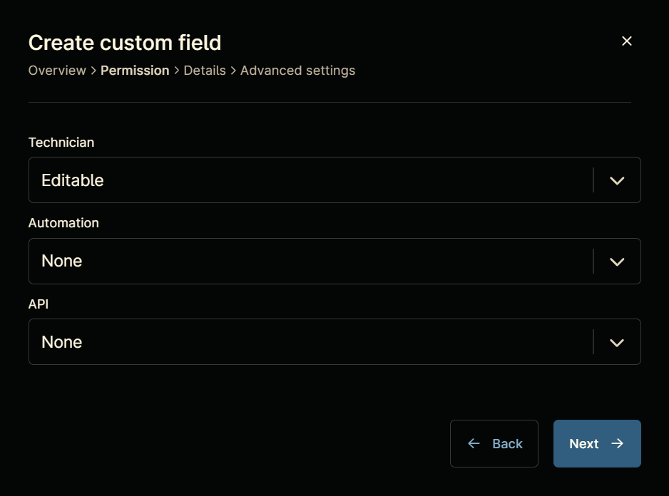

### Step 6

Set the following details in the `Permission` section and click the `Next` button.  

**Technician:** `Editable`  
**Automation:** `Read/Write`  
**API:** `Read/Write`

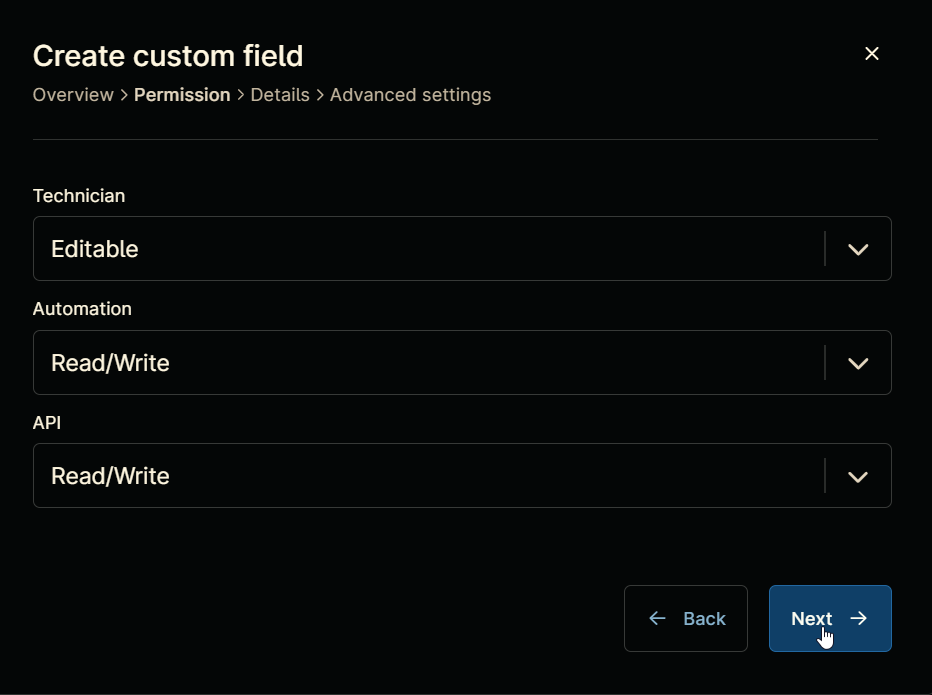

Clicking the `Next` button will take you to the details tab.  
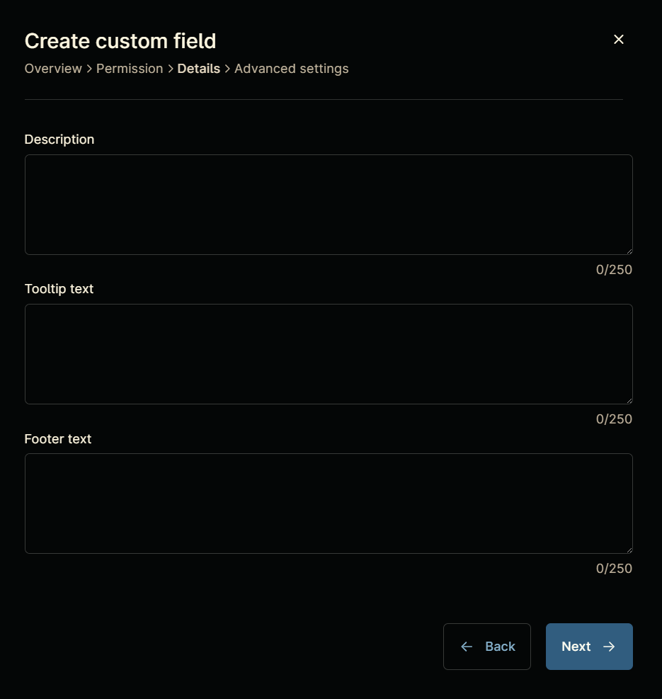

### Step 7

Fill in the following information in the `Details` section and click the `Next` button.

**Description:** `When enabled, Duo authentication is required only for remote logins via RDP. If not, Duo authentication is required for both console and RDP logins. The default is disabled, meaning Duo protects both.`  
**Tooltip Text:** `Select the platform to enable DUO RDPOnly`  
**Footer Text:** `DUO RDPONLY`

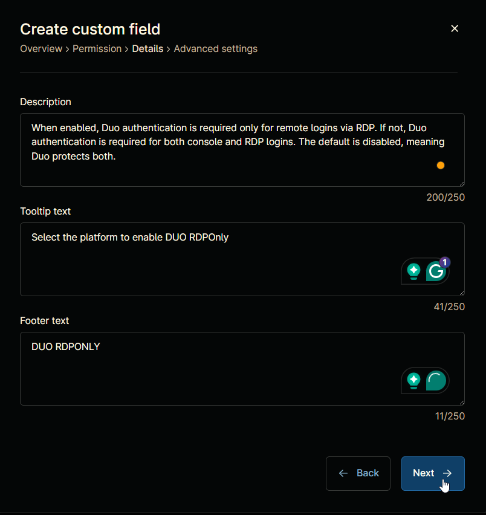

Clicking the `Next` button will take you to the `Advanced Settings` tab.  
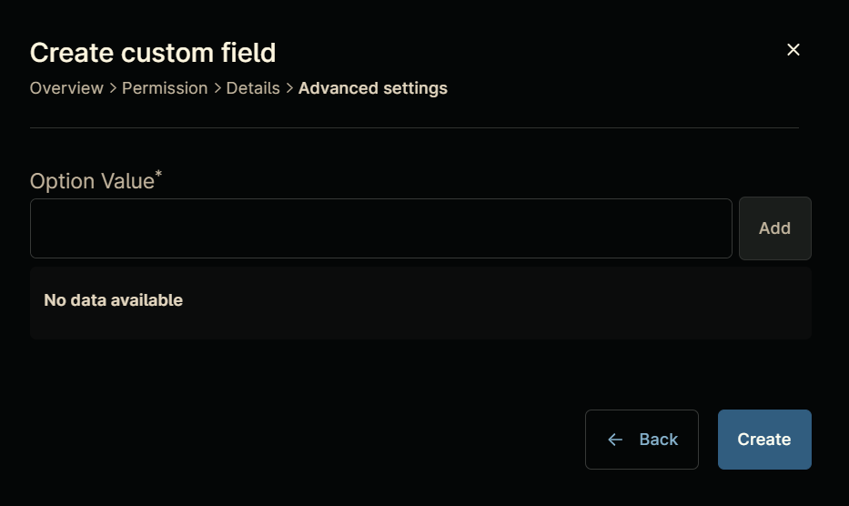

### Step 8

Configure the following options in the specified order. To add an option, paste it and click the `Add` button:

- Windows  
- Windows Workstations
- Windows Servers
- Disabled

Click the `Create` button to create the `Custom Field`.  
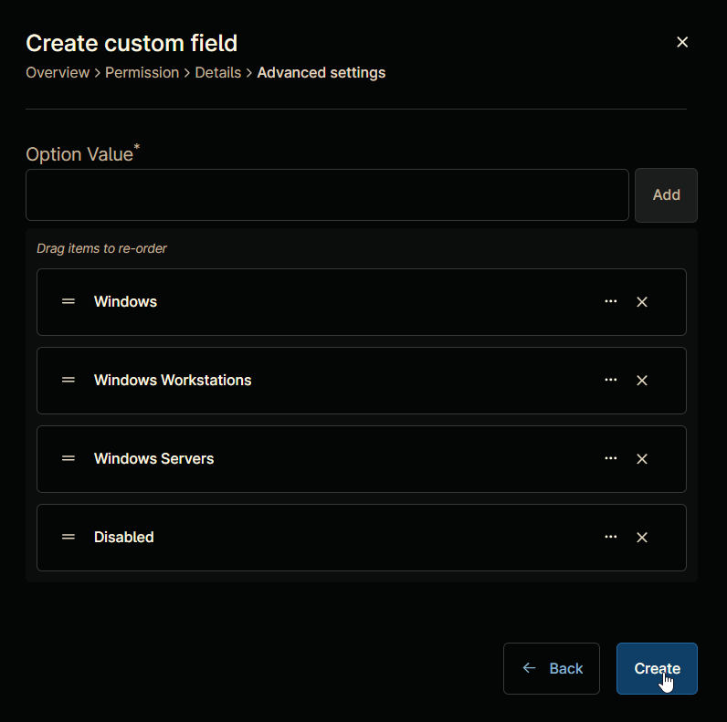

## Completed Custom Field

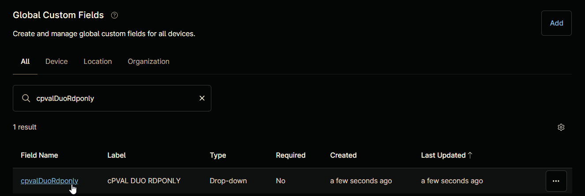

## Example

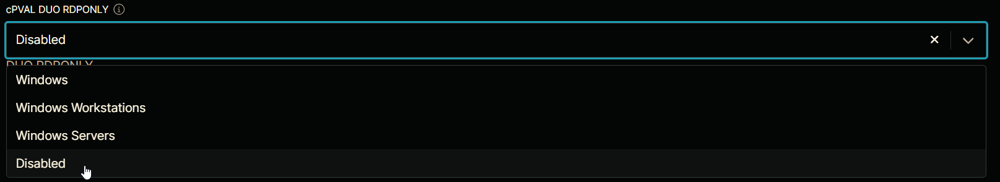
