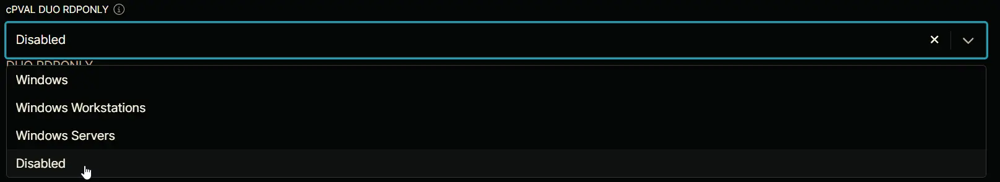

## Summary

When enabled, Duo authentication is required only for remote logins via RDP. If not, Duo authentication is required for both console and RDP logins. The default is disabled, meaning Duo protects both.

## Details

| Label | Field Name | Definition Scope | Type | Option Value | Default Value | Required  | Technician Permission | Automation Permission | API Permission | Description | Tool Tip | Footer Text | Custom Field Tab Name | 
| ----- | ---------- | ---------------- | ---- | ------------ | ------------- | --------- | --------------------- | --------------------- | -------------- | ----------- | -------- | ----------- | ------- | 
| cPVAL DUO RDPONLY | cpvalDuoRdponly | Organization | drop-down | `Windows`, `Windows Workstations`, `Windows Servers`,  `Disabled` | Disabled | False | Editable | Read/Write | Read/Write | When enabled, Duo authentication is required only for remote logins via RDP. If not, Duo authentication is required for both console and RDP logins. The default is disabled, meaning Duo protects both. | Select the platform to enable DUO RDPOnly | DUO RDPONLY | DUO |

## Dependencies

- [Solution - Duo Deployment](/docs/a11cd829-a491-4cb1-a7c1-3f56fa8c7557)

## Custom Field Creation

- [Custom Field Configuration](https://github.com/ProVal-Tech/ninjarmm/blob/main/custom-fields/cpval-duo-rdponly.toml)

## Sample Screenshot

## Changelog

### 2026-05-28

* Updated the documentation to align with the new documentation format and standards.

### 2025-04-14

- Initial version of the document
