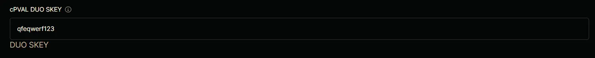

## Summary

This is a sensitive piece of information, akin to a password, used in conjunction with the IKEY. The SKEY is used to sign communication between your application and Duo’s service securely.

## Details

| Label | Field Name | Definition Scope | Type | Required  | Technician Permission | Automation Permission | API Permission | Description | Tool Tip | Footer Text | Custom Field Tab Name |
| ----- | ---------- | ---------------- | ---- | --------- | --------------------- | --------------------- | -------------- | ----------- | -------- | ----------- | ------ | 
| cPVAL DUO SKEY | cpvalDuoSkey | Organization | Text | False | Editable | Read/Write | Read/Write | This is a sensitive piece of information, akin to a password, used in conjunction with the IKEY. The SKEY is used to sign communication between your application and Duo’s service securely. | Provide the secret key from the Duo Admin Panel. | DUO SKEY | DUO |

## Dependencies

- [Solution - Duo Deployment](/docs/a11cd829-a491-4cb1-a7c1-3f56fa8c7557)

## Custom Field Creation

- [Custom Field Configuration](https://github.com/ProVal-Tech/ninjarmm/blob/main/custom-fields/cpval-duo-skey.toml)

## Sample Screenshot

## Changelog

### 2026-05-25

* Updated the documentation to align with the new documentation format and standards.

### 2025-04-14

- Initial version of the document
