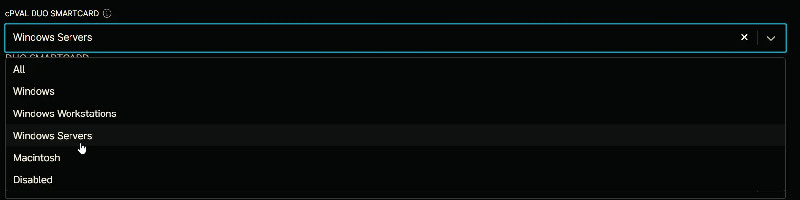

## Summary

If enabled, it allows smart card login as an alternative to Duo authentication. If not, it disables the Windows smart card provider. The default is blank, which does not allow smart card login without Duo approval.

## Details

| Label | Field Name | Definition Scope | Type | Option Value | Default Value | Required  | Technician Permission | Automation Permission | API Permission | Description | Tool Tip | Footer Text | Custom Field Tab Name | 
| ----- | ---------- | ---------------- | ---- | ------------ | ------------- | --------- | --------------------- | --------------------- | -------------- | ----------- | -------- | ----------- | ----- | 
| cPVAL DUO SMARTCARD | cpvalDuoSmartcard | Organization | drop-down | `All`, `Windows`, `Windows Workstations`, `Windows Servers`, `Macintosh`, `Disabled` | `Disabled` | False | Editable | Read/Write | Read/Write | If enabled, it allows smart card login as an alternative to Duo authentication. If not, it disables the Windows smart card provider. The default is blank, which does not allow smart card login without Duo approval. | Select the platform to enable DUO SmartCard | DUO SMARTCARD | DUO |

## Dependencies

- [Solution - Duo Deployment](/docs/a11cd829-a491-4cb1-a7c1-3f56fa8c7557)

## Custom Field Creation

- [Custom Field Configuration](https://github.com/ProVal-Tech/ninjarmm/blob/main/custom-fields/cpval-duo-smartcard.toml)

## Sample Screenshot

## Changelog

### 2026-05-28

- Updated the documentation to align with the new documentation format and standards.

### 2025-04-14

- Initial version of the document
