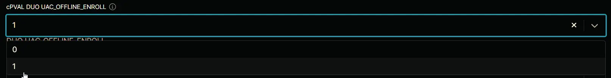

## Summary

0 to prevent Offline Enrollment during User Elevation; 1 to Enable Offline Enrollment during User Elevation

## Details

| Label | Field Name | Definition Scope | Type | Option Value | Default Value | Required  | Technician Permission | Automation Permission | API Permission | Description | Tool Tip | Footer Text | Custom Field Tab Name |
| ----- | ---------- | ---------------- | ---- | ------------ | ------------- | --------- | --------------------- | --------------------- | -------------- | ----------- | -------- | ----------- | --------- |
| cPVAL DUO UAC_OFFLINE_ENROLL | cpvalDuoUacofflineenroll | Organization | drop-down | `0`, `1` | `1` | False | Editable | Read/Write | Read/Write | 0 to prevent Offline Enrollment during User Elevation; 1 to Enable Offline Enrollment during User Elevation | Select the option for Offline Enrollment during User Elevation. The default value is 1 | DUO UAC_OFFLINE_ENROLL |  DUO |

## Dependencies

- [Solution - Duo Deployment](/docs/a11cd829-a491-4cb1-a7c1-3f56fa8c7557)

## Custom Field Creation

- [Custom Field Configuration](https://github.com/ProVal-Tech/ninjarmm/blob/main/custom-fields/cpval-duo-uac-offline-enroll.toml)

## Sample Screenshot

## Changelog

### 2026-05-25

* Updated the documentation to align with the new documentation format and standards.

### 2025-04-15

- Initial version of the document
