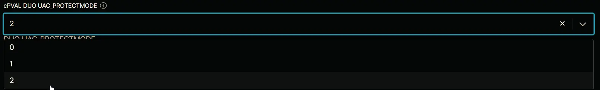

## Summary

0 to respect existing Duo authentication control around logon; 1 to Disable Duo at logon and only prompt during User Elevation; 2 to enforce Duo at logon and User Elevation

## Details

| Label | Field Name | Definition Scope | Type | Option Value | Default Value | Required  | Technician Permission | Automation Permission | API Permission | Description | Tool Tip | Footer Text | Custom Field Tab Name |  
| ----- | ---------- | ---------------- | ---- | ------------ | ------------- | --------- | --------------------- | --------------------- | -------------- | ----------- | -------- | ----------- | ----- |
| cPVAL DUO UAC_PROTECTMODE | cpvalDuoUacprotectmode | Organization | drop-down | `0`, `1`, `2` | `0` | False | Editable | Read/Write | Read/Write | 0 to respect existing Duo authentication control around logon; 1 to Disable Duo at logon and only prompt during User Elevation; 2 to enforce Duo at logon and User Elevation | Select the UAC Protect Mode. The default value is 0 | DUO UAC_PROTECTMODE | DUO |

## Dependencies

- [Solution - Duo Deployment](/docs/a11cd829-a491-4cb1-a7c1-3f56fa8c7557)

## Custom Field Creation

- [Custom Field Configuration](https://github.com/ProVal-Tech/ninjarmm/blob/main/custom-fields/cpval-duo-uac-protectmode.toml)

## Sample Screenshot

## Changelog

### 2026-05-28

* Updated the documentation to align with the new documentation format and standards.

### 2025-04-14

- Initial version of the document
